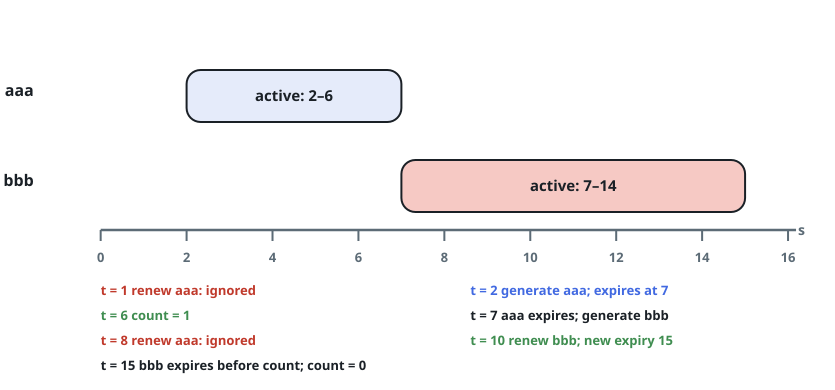

# Expiring Token Ledger

## Description

An authentication system issues time-limited tokens. Each token expires
`timeToLive` seconds after the moment it was issued, and renewing an
unexpired token pushes its expiry to `timeToLive` seconds after the
renewal moment instead.

Implement the `TokenLedger` class:

- `TokenLedger(int timeToLive)` initializes the ledger with the given
  lifetime.
- `void generate(string tokenId, int currentTime)` issues a new token
  with the given id at `currentTime`.
- `void renew(string tokenId, int currentTime)` extends the unexpired
  token with the given id to expire `timeToLive` seconds after
  `currentTime`. If no unexpired token with that id exists, the request
  is ignored.
- `int countUnexpiredTokens(int currentTime)` returns how many tokens
  are unexpired at `currentTime`.

An expiring action happens before any other action at the same moment: a
token that expires exactly at time `t` is already dead for a renewal or
count issued at `t`.

### Example 1



```text
Input:
["TokenLedger", "renew", "generate", "countUnexpiredTokens", "generate", "renew", "renew", "countUnexpiredTokens"]
[[5], ["aaa", 1], ["aaa", 2], [6], ["bbb", 7], ["aaa", 8], ["bbb", 10], [15]]
Output: [null, null, null, 1, null, null, null, 0]
Explanation:
TokenLedger tokenLedger = new TokenLedger(5); // Constructs the ledger with timeToLive = 5 seconds.
tokenLedger.renew("aaa", 1); // No token "aaa" exists at time 1, so nothing happens.
tokenLedger.generate("aaa", 2); // Issues token "aaa" at time 2; it expires at time 7.
tokenLedger.countUnexpiredTokens(6); // "aaa" is the only live token at time 6, so return 1.
tokenLedger.generate("bbb", 7); // Issues token "bbb" at time 7.
tokenLedger.renew("aaa", 8); // "aaa" expired at time 7, and 8 >= 7, so the renewal is ignored.
tokenLedger.renew("bbb", 10); // "bbb" is live at time 10, so its expiry moves to time 15.
tokenLedger.countUnexpiredTokens(15); // "bbb" expires exactly at 15 and "aaa" expired long before, so return 0.
```

### Constraints

- `1 <= timeToLive <= 10⁸`
- `1 <= currentTime <= 10⁸`
- `1 <= tokenId.length <= 5`
- `tokenId` consists only of lowercase letters.
- All calls to `generate` will contain unique values of `tokenId`.
- The values of `currentTime` across all the function calls are strictly
  increasing.
- At most `2000` calls are made to all functions combined.

## Hints

### Hint 1

A token's identity is its expiry time — store token ids in a map from id
to expiry.

### Hint 2

Because `currentTime` strictly increases, expired entries are dead
forever; prune them lazily on each call, or keep a queue ordered by
expiry and pop from the front.
