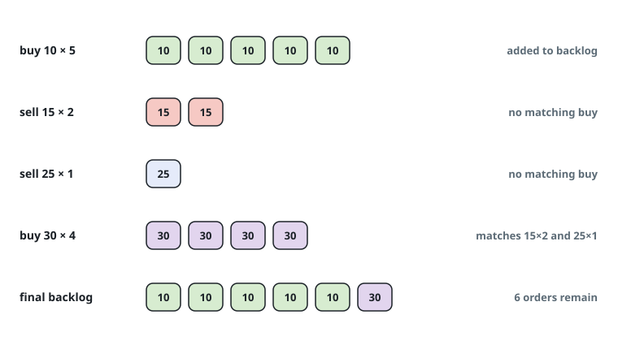
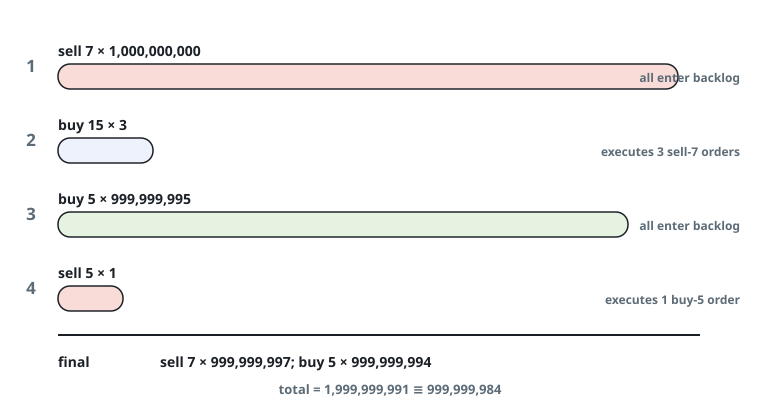

# Unfilled Orders After Matching

## Description

An exchange processes trade orders batch by batch. The input `orders`
satisfies `orders[i] = [price_i, amount_i, type_i]`: a batch of `amount_i`
orders all priced `price_i`, where `type_i` is `0` for a batch of buy
orders and `1` for a batch of sell orders. Batches arrive in input order,
and each one stands for `amount_i` fully independent orders — the batch
wrapper is only a compact way to write them down.

Orders that cannot trade on arrival wait in the exchange's order book,
which starts empty. Placing a batch runs a small auction against the book:

- A buy batch keeps trading against the cheapest sell orders currently
  waiting. Every time that cheapest waiting price is at most the buy
  price, one order from each side executes and the sell order leaves the
  book; the moment the condition breaks, trading stops.
- A sell batch works symmetrically: it keeps trading against the most
  expensive waiting buy orders while that price is at least the sell
  price.

A waiting batch that is only partly consumed stays in the book with its
remaining count and can trade again later; it leaves only when its count
hits zero. Whatever part of the incoming batch finds no counterparty, if
any, enters the book as one new waiting batch.

After all batches are placed, return how many orders are still waiting in
the book. The count can be enormous, so report it modulo 10⁹ + 7.

### Example 1



```text
Input: orders = [[10,5,0],[15,2,1],[25,1,1],[30,4,0]]
Output: 6
Explanation: The 5 buys at price 10 arrive to an empty book and wait.
The sell batches at 15 and 25 find no waiting buy expensive enough to
trade, so both wait as well. Then the 4 buys at price 30 sweep the book:
two trades absorb the sells at 15 and one more absorbs the sell at 25,
which leaves a single unmatched buy that waits. The book ends with 5 buys
at 10 plus 1 buy at 30 — 6 orders altogether.
```

### Example 2



```text
Input: orders = [[7,1000000000,1],[15,3,0],[5,999999995,0],[5,1,1]]
Output: 999999984
Explanation: The 10⁹ sells at price 7 all wait. The 3 buys at price 15
execute three of them, leaving 999999997 sells in the book. The
999999995 buys at price 5 never reach price 7, so they wait too. Last, 1
sell at price 5 trades the top waiting buy (price 5) and removes it. The
book now holds 999999997 sells at 7 and 999999994 buys at 5: 1999999991
orders, which is 999999984 modulo 10⁹ + 7.
```

### Constraints

- `1 <= orders.length <= 10⁵`
- `orders[i].length == 3`
- `1 <= price_i, amount_i <= 10⁹`
- `type_i` is `0` or `1`.

## Hints

### Hint 1

Matching only ever inspects the two extreme prices of the book, so two
heaps are enough: waiting sells in a min-heap on price, waiting buys in a
max-heap on price. Each "best counterparty" question then costs
logarithmic time.

### Hint 2

Let each batch occupy a single heap entry and shrink that entry's amount
as trades execute — never split a batch into one heap entry per order, or
the sizes explode.
