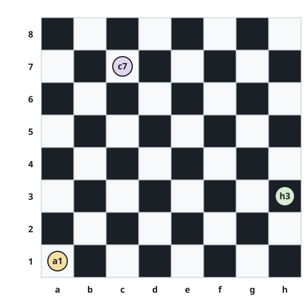

# Shade of a Chessboard Square

## Description

On a standard chessboard, any two squares that share an edge always have
opposite shades. Columns are labeled `a` through `h` from left to right
and rows `1` through `8` from bottom to top, so every square carries a
two-character label — letter first, digit second.



You are given `coordinates`, the label of one square of this board.
Return `true` if that square is white and `false` if it is black. The
label is always a valid square of the board.

### Example 1

```text
Input: coordinates = "d5"
Output: true
Explanation: On the board above, the square labeled "d5" is white, so
the answer is true.
```

### Example 2

```text
Input: coordinates = "b8"
Output: false
```

### Example 3

```text
Input: coordinates = "f6"
Output: false
```

### Constraints

- `coordinates.length == 2`
- `'a' <= coordinates[0] <= 'h'`
- `'1' <= coordinates[1] <= '8'`

## Hints

### Hint 1

Number the columns 1 through 8 and the rows 1 through 8, so each label
names a pair `(file, rank)` — for instance `"a1"` is `(1, 1)` and `"d5"`
is `(4, 5)`.

### Hint 2

Step from any square to an edge neighbor and the shade flips. Combine the
parities of the two numbers and look at how the sum behaves.
