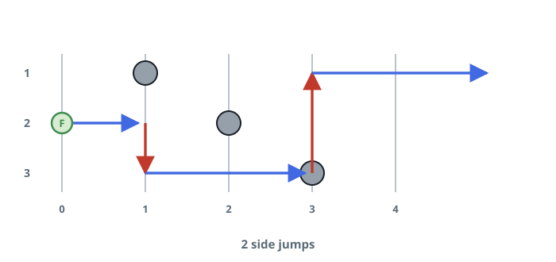
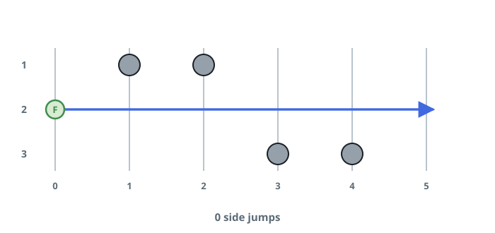
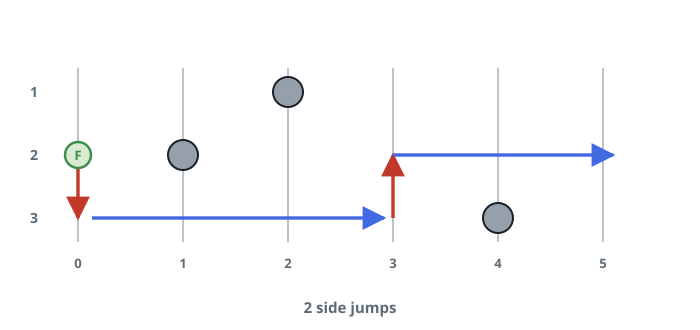

# Fewest Lane Changes

## Description

A three-lane road is divided into `n + 1` checkpoints numbered `0` through
`n`. A frog starts at checkpoint 0 in lane 2 and wants to reach checkpoint
`n`.

The road carries obstacles, described by an array `obstacles` of length
`n + 1`: `obstacles[i]` (between `0` and `3`) names the lane blocked at
checkpoint `i`, or `0` when all lanes there are clear. At most one lane is
blocked per checkpoint — for instance, `obstacles[2] == 1` places an
obstacle in lane 1 at checkpoint 2.

Two moves are available:

- The frog advances from checkpoint `i` to checkpoint `i + 1` along its
  current lane, but only if that lane is unblocked at `i + 1`.
- While staying at its current checkpoint, the frog may switch to any other
  lane — adjacent or not — provided that lane is unblocked there. Each
  switch costs one lane change.

Return the fewest lane changes that get the frog to checkpoint `n` in any
lane, starting from lane 2 at checkpoint 0.

Note: checkpoints `0` and `n` are always obstacle-free.

### Example 1



```text
Input: obstacles = [0,1,2,3,0]
Output: 2
Explanation: The arrows trace an optimal route: two lane changes (the red
arrows) carry the frog past the obstacles stacked over checkpoints 1
through 3. Note the change at checkpoint 2 crosses the blocked lanes
directly — a lane change may leap over obstacles, forward motion may not.
```

### Example 2



```text
Input: obstacles = [0,1,1,3,3,0]
Output: 0
Explanation: Lane 2 is clear at every checkpoint, so the frog runs straight
through without ever changing lanes.
```

### Example 3



```text
Input: obstacles = [0,2,1,0,3,0]
Output: 2
Explanation: The arrows show an optimal route with two lane changes — out
to lane 1 at the start, then back to lane 2 at checkpoint 2 — after which
the road to checkpoint 5 is clear.
```

### Constraints

- `obstacles.length == n + 1`
- `1 <= n <= 5 * 10⁵`
- `0 <= obstacles[i] <= 3`
- `obstacles[0] == obstacles[n] == 0`

### Hint 1

At any checkpoint the frog's entire situation is one of just three states —
which lane it stands in.

### Hint 2

Sweep the checkpoints once: advancing in lane is free, so each open lane's
cost at the next checkpoint is at most the current cheapest lane's cost plus
one change.
