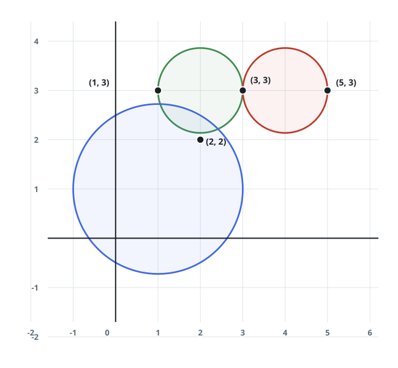
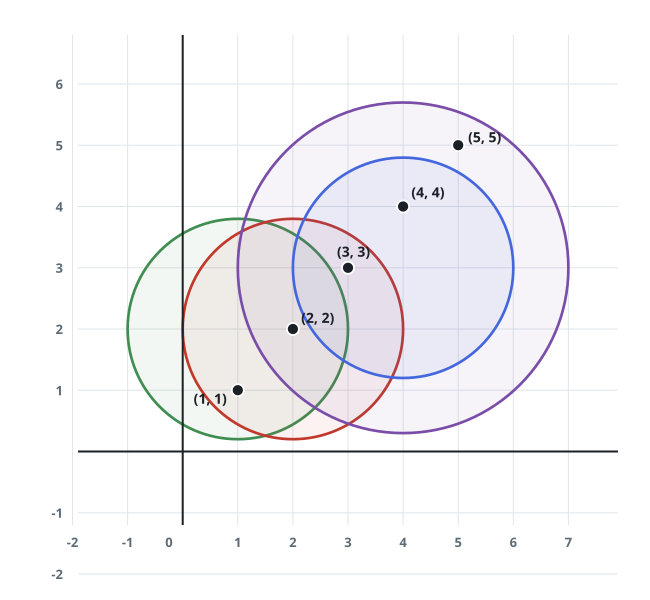

# Points Caught by Each Circle

## Description

On a 2D plane you are given `points`, where `points[i] = [xi, yi]` holds the
coordinates of the i-th point; several points may share a location. You are
also given `queries`, where `queries[j] = [xj, yj, rj]` places a circle of
radius `rj` at center `(xj, yj)`.

For every circle, count how many of the points lie within it — a point
sitting exactly on the rim counts as inside. Return an array where entry
`j` holds the count for `queries[j]`.

### Example 1



```text
Input: points = [[1,3],[3,3],[5,3],[2,2]], queries = [[2,3,1],[4,3,1],[1,1,2]]
Output: [3,2,2]
Explanation: The picture above shows the points together with the three
circles: the first query draws the green circle, the second the red one,
and the third the blue one.
```

### Example 2



```text
Input: points = [[1,1],[2,2],[3,3],[4,4],[5,5]], queries = [[1,2,2],[2,2,2],[4,3,2],[4,3,3]]
Output: [2,3,2,4]
Explanation: The four circles are drawn above — green, red, blue, and
purple, in query order.
```

### Example 3

```text
Input: points = [[7,8],[9,6],[2,10]], queries = [[6,8,2],[5,9,4],[1,4,3]]
Output: [1,2,0]
Explanation: The circle at (6,8) catches only [7,8]; the wider circle at
(5,9) also reaches [2,10]; no point falls within reach of (1,4).
```

### Constraints

- `1 <= points.length <= 500`
- `points[i].length == 2`
- `0 <= xi, yi <= 500`
- `1 <= queries.length <= 500`
- `queries[j].length == 3`
- `0 <= xj, yj <= 500`
- `1 <= rj <= 500`
- Every coordinate is an integer.

### Follow up

Can you answer each query faster than scanning all of the points?

## Hints

### Hint 1

A point belongs to a circle precisely when its squared distance from the
center is at most the squared radius.

### Hint 2

Comparing squared values keeps the test in exact integer arithmetic, so a
point on the rim never falls victim to square-root rounding.
