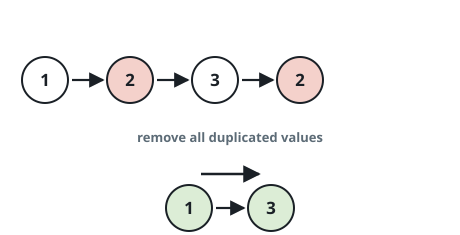
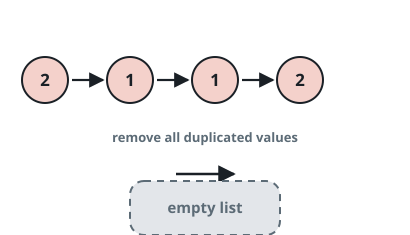

# Drop Every Repeated Value

## Description

You are given the `head` of a linked list. A value is _repeated_ when it
occurs more than once anywhere in the list. Remove every node carrying a
repeated value — not just the extra copies — and return the `head` of the
list that remains.

### Example 1



```text
Input: head = [1,2,3,2]
Output: [1,3]
Explanation: The value 2 shows up twice, so both 2-nodes are removed and
[1,3] is what survives.
```

### Example 2



```text
Input: head = [2,1,1,2]
Output: []
Explanation: Each of 1 and 2 occurs twice, so no node survives and the
result is empty.
```

### Example 3


```text
Input: head = [3,2,2,1,3,2,4]
Output: [1,4]
Explanation: 3 occurs twice and 2 occurs three times; dropping every node
holding one of those values leaves [1,4].
```

### Constraints

- The list contains between `1` and `10⁵` nodes.
- Every node value is between `1` and `10⁵`.

## Hints

### Hint 1

Could you work out which nodes must go before you start unlinking
anything?

### Hint 2

Tally how often each value occurs first; a second pass then knows
exactly which nodes to keep.
