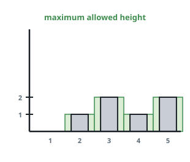
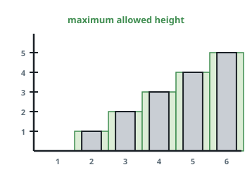
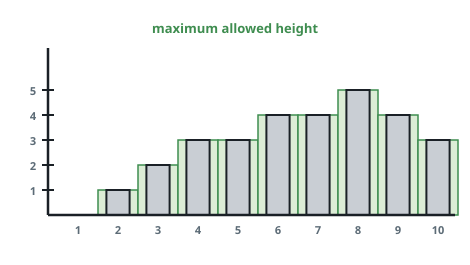

# Tallest Possible Skyline

## Description

A row of `n` buildings is going up, labeled `1` through `n` from left to
right, and you choose every height. Three city-wide rules apply:

- Every height is a non-negative integer.
- Building `1` must have height `0`.
- Neighboring buildings may differ in height by at most `1`.

On top of that, some spots carry a hard cap: `restrictions[i] =
[id_i, max_height_i]` means building `id_i` may not rise above
`max_height_i`. No building is listed twice, and building `1` is never
listed.

Choose the heights so the tallest building is as tall as these rules
allow, and report that height.

### Example 1



```text
Input: n = 5, restrictions = [[2,1],[4,1]]
Output: 2
Explanation: The shaded region in the picture bounds each building's
height. Heights [0,1,2,1,2] are legal and top out at 2.
```

### Example 2



```text
Input: n = 6, restrictions = []
Output: 5
Explanation: With no caps the skyline simply climbs one per building:
[0,1,2,3,4,5], whose tallest is 5.
```

### Example 3



```text
Input: n = 10, restrictions = [[5,3],[2,5],[7,4],[10,3]]
Output: 5
Explanation: Under the four caps, heights [0,1,2,3,3,4,4,5,4,3] are
legal, and no arrangement beats their tallest of 5.
```

### Constraints

- `2 <= n <= 10⁹`
- `0 <= restrictions.length <= min(n - 1, 10⁵)`
- `2 <= id_i <= n`
- Every `id_i` is distinct.
- `0 <= max_height_i <= 10⁹`

## Hints

### Hint 1

If you already knew the height window at every capped building, could
you finish the problem?

### Hint 2

Two sweeps over the sorted caps — one from the left, one from the right
— shrink each cap to the tallest value its neighbors still permit.

### Hint 3

Between two consecutive pinned points with effective caps `lh` and `rh`
separated by `g` positions, the best peak in between is the floored
`(lh + rh + g) / 2`; past the last pin the height just ramps to
`cap + distance`.
