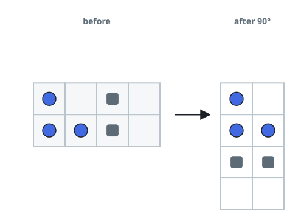

# Tipping the Stone Crate

## Description

A crate is viewed from the side as an `m x n` grid of characters
`boxGrid`. Each cell holds one of three things:

- a stone `'#'`
- a fixed obstacle `'*'`
- empty space `'.'`

The crate is tipped 90 degrees clockwise. Stones obey gravity after the
tip: each one slides as far down as it can, stopping only against an
obstacle, another stone, or the crate floor. Obstacles never move, no
matter what, and tipping does not fling stones sideways within their
row — the settling described above is the only motion.

Every stone starts out resting on an obstacle, another stone, or the
bottom of the crate.

Return the resulting `n x m` grid — the crate's contents after the tip
and the settling it caused.

### Example 1


```text
Input: boxGrid = [["#",".","#"]]
Output: [["."],
         ["#"],
         ["#"]]
```

### Example 2



```text
Input: boxGrid = [["#",".","*","."],
                  ["#","#","*","."]]
Output: [["#","."],
         ["#","#"],
         ["*","*"],
         [".","."]]
```

### Example 3


```text
Input: boxGrid = [["#","#","*",".","*","."],
                  ["#","#","#","*",".","."],
                  ["#","#","#",".","#","."]]
Output: [[".","#","#"],
         [".","#","#"],
         ["#","#","*"],
         ["#","*","."],
         ["#",".","*"],
         ["#",".","."]]
```

### Constraints

- `m == boxGrid.length`
- `n == boxGrid[i].length`
- `1 <= m, n <= 500`
- `boxGrid[i][j]` is either `'#'`, `'*'`, or `'.'`.

## Hints

### Hint 1

The clockwise tip is just the index map `tipped[r][c] =
crate[m - 1 - c][r]` — settle the stones first, then move them.

### Hint 2

To settle one row, walk it from the right wall leftward with a write
cursor that marks the next resting spot; obstacles reset the cursor, and
every stone met takes the current cursor position.
