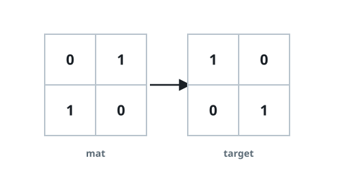
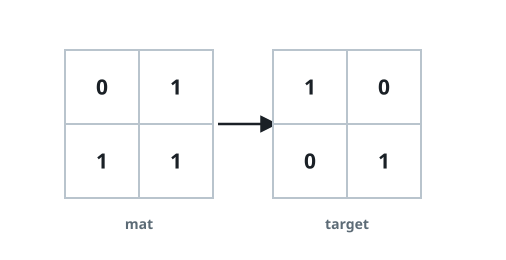
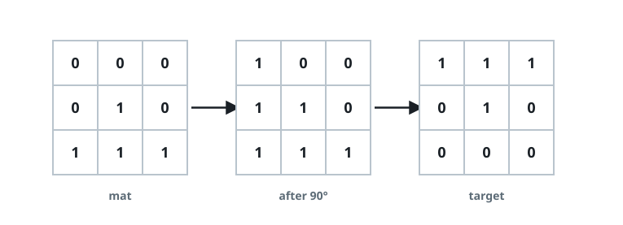

# Quarter Turns to Match the Target

## Description

You are given two `n x n` binary matrices, `mat` and `target`. Decide
whether some number of quarter turns — zero, one, two, or three 90-degree
clockwise rotations — can line `mat` up exactly with `target`. A fourth
turn returns any square grid to where it began, so those four
orientations are the whole search space. Return `true` if a match is
reachable this way and `false` otherwise.

### Example 1



```text
Input: mat = [[0,1],[1,0]], target = [[1,0],[0,1]]
Output: true
Explanation: A single quarter turn of mat lands on target.
```

### Example 2



```text
Input: mat = [[0,1],[1,1]], target = [[1,0],[0,1]]
Output: false
Explanation: None of the four orientations of mat reproduces target.
```

### Example 3



```text
Input: mat = [[0,0,0],[0,1,0],[1,1,1]],
       target = [[1,1,1],[0,1,0],[0,0,0]]
Output: true
Explanation: Turning mat twice by 90 degrees clockwise produces target.
```

### Constraints

- `n == mat.length == target.length`
- `n == mat[i].length == target[i].length`
- `1 <= n <= 10`
- `mat[i][j]` and `target[i][j]` are each 0 or 1.

## Hints

### Hint 1

Only four orientations exist, and the grid is tiny — checking each one
outright beats any cleverness.

### Hint 2

Row `r` of a clockwise quarter turn reads column `r` of the source from
bottom to top: `new[r][c] = old[n-1-c][r]`.
