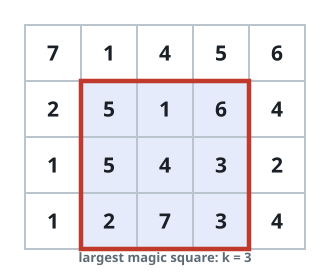
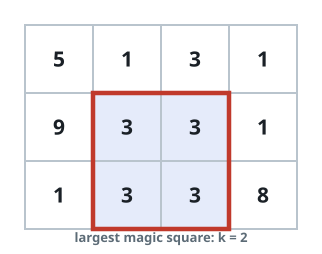

# Largest Sum-Matched Square

## Description

Call a `k x k` block of cells balanced when every one of its `k` row
sums, every one of its `k` column sums, and both of its diagonal sums
come out to the same value. The cells may repeat values freely, and
every `1 x 1` block is balanced by definition.

Given an `m x n` integer grid, return the side length `k` of the
biggest balanced square block the grid contains.

### Example 1



```text
Input: grid = [[7,1,4,5,6],[2,5,1,6,4],[1,5,4,3,2],[1,2,7,3,4]]
Output: 3
Explanation: The best balanced block is 3 x 3, and every line inside
it adds up to 12.
- Row sums: 5+1+6 = 5+4+3 = 2+7+3 = 12
- Column sums: 5+5+2 = 1+4+7 = 6+3+3 = 12
- Diagonal sums: 5+4+3 = 6+4+2 = 12
```

### Example 2



```text
Input: grid = [[5,1,3,1],[9,3,3,1],[1,3,3,8]]
Output: 2
```

### Constraints

- `m == grid.length`
- `n == grid[i].length`
- `1 <= m, n <= 50`
- `1 <= grid[i][j] <= 10⁶`

## Hints

### Hint 1

The grid is small enough to examine every square block, keeping the
largest one that qualifies.
