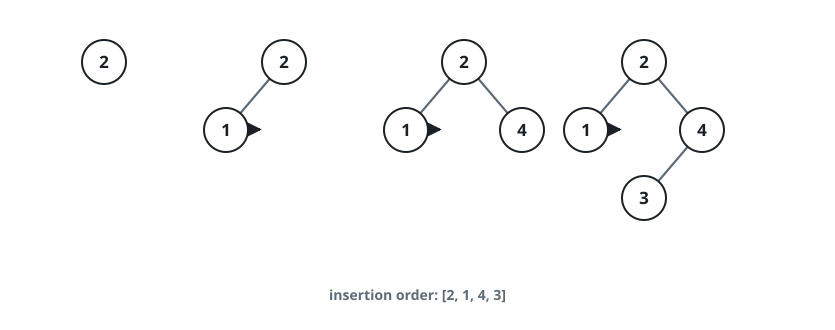
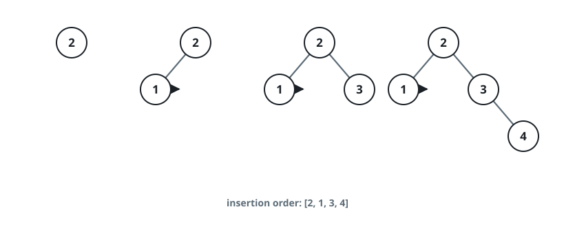
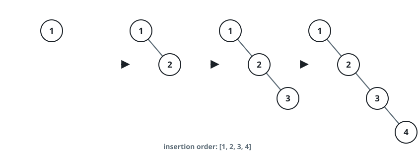

# Depth of a Grown Search Tree

## Description

Keys `1` through `n` are planted one at a time into an initially empty
binary search tree, arriving in the sequence given by the **0-indexed**
array `order` — a permutation of the integers from `1` to `n`.

A binary search tree keeps one ordering invariant: every key in a node's
left subtree is smaller than that node's key, every key in its right
subtree is larger, and both subtrees satisfy the same rule.

The tree grows as follows:

- `order[0]` becomes the root.
- Each later key is attached as the child of an existing node so the
  invariant still holds — the slot it must occupy is unique.

Return the depth of the finished tree: the number of keys on the longest
path from the root down to a leaf.

### Example 1



```text
Input: order = [2,1,4,3]
Output: 3
Explanation: Key 2 becomes the root, 1 attaches to its left and 4 to its
right; 3 then lands under 4. The deepest path 2 -> 4 -> 3 holds 3 keys.
```

### Example 2



```text
Input: order = [2,1,3,4]
Output: 3
Explanation: After 2, 1, and 3 settle, the key 4 descends past 2 and 3,
extending the path 2 -> 3 -> 4 to a depth of 3.
```

### Example 3



```text
Input: order = [1,2,3,4]
Output: 4
Explanation: Ascending insertions hang each key off the previous one,
producing the straight chain 1 -> 2 -> 3 -> 4 of depth 4.
```

### Constraints

- `n == order.length`
- `1 <= n <= 10⁵`
- `order` contains every integer from `1` to `n` exactly once.

## Hints

### Hint 1

A new key can only be parented by one of its two value-neighbours among
the keys already planted — at most two candidate spots, never a scan of
the whole tree.

### Hint 2

If you knew each key's parent you would be done, since parents are always
planted before their children. Can a single left-to-right sweep over the
values, with a stack of still-unfinished keys, recover every parent
without simulating the walks?
