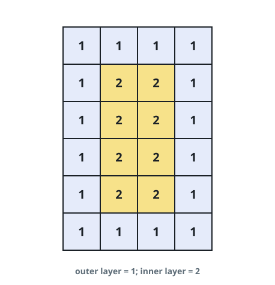
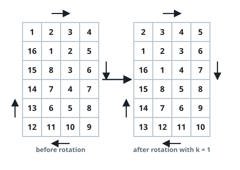
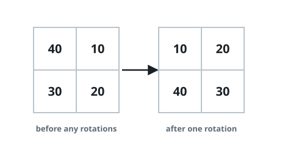
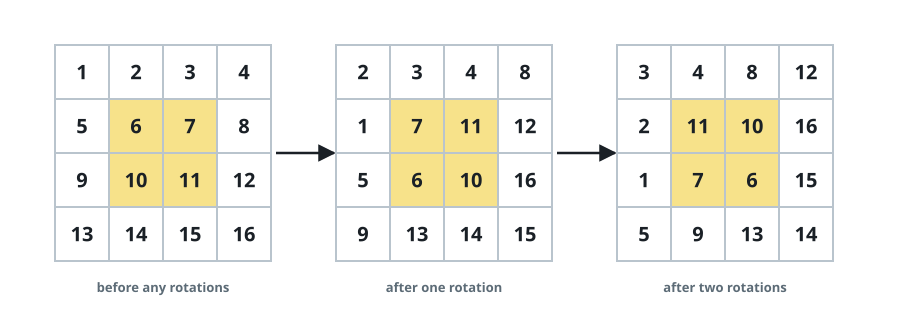

# Concentric Ring Turn

## Description

You are given an `m x n` matrix `grid` of integers and an integer `k`; both
`m` and `n` are even. The matrix splits into concentric square layers — the
outer border is the first layer, the border of the rectangle left after
stripping it is the second, and so on, as the colors show:



One turn of the whole matrix advances every layer at once. Within a layer,
each element slides into the cell of its counter-clockwise neighbour, so the
entire ring shifts by one position:



Apply `k` full turns to `grid` and return the matrix that results.

### Example 1



```text
Input: grid = [[40,10],[30,20]], k = 1
Output: [[10,20],[40,30]]
Explanation: The figure follows the single layer through its one-position
slide.
```

### Example 2





```text
Input: grid = [[1,2,3,4],[5,6,7,8],[9,10,11,12],[13,14,15,16]], k = 2
Output: [[3,4,8,12],[2,11,10,16],[1,7,6,15],[5,9,13,14]]
Explanation: The figures show the grid before the turns, after the first
turn, and after the second; the outer and inner rings each advance twice.
```

### Constraints

- `m == grid.length` and `n == grid[i].length`
- `2 <= m, n <= 50`, and both are even
- `1 <= grid[i][j] <= 5000`
- `1 <= k <= 10^9`

## Hints

### Hint 1

Treat each layer on its own: walking its border cell by cell turns the ring
into a plain list, and one turn of the layer is a cyclic shift of that list.

### Hint 2

A ring returns to its starting arrangement after as many shifts as it has
cells, so shrink `k` modulo the ring length first — that is what keeps a
`k` of a billion from costing anything.
