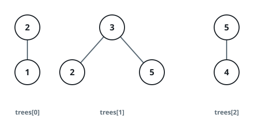
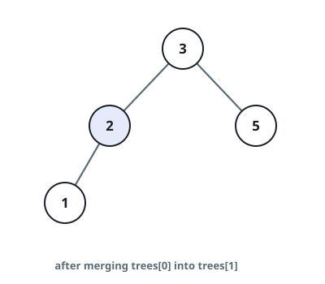
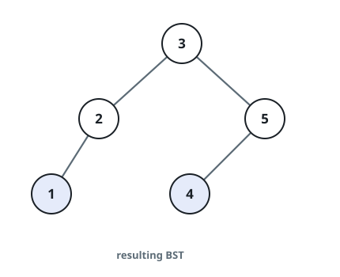
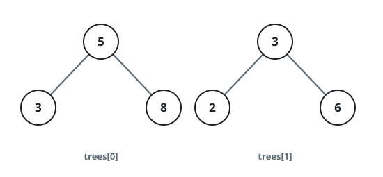
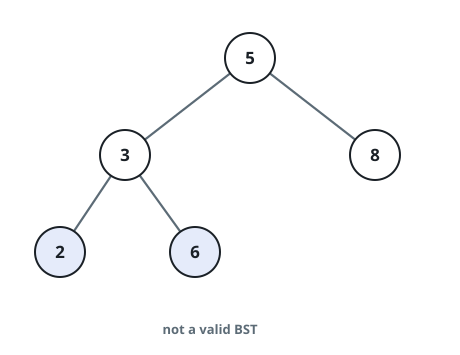
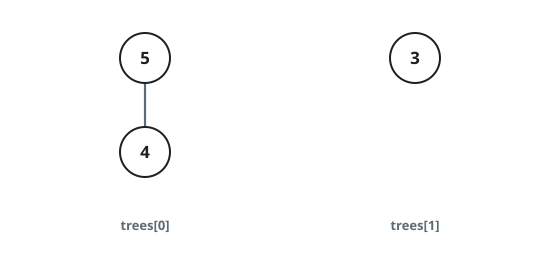

# One BST From Many

## Description

You are given an array `trees` (0-indexed) holding the root nodes of `n`
separate binary search trees. Each of those trees has at most 3 nodes, and
no two roots share a value. You may repeatedly perform the following
operation:

- Pick two distinct indices `i` and `j` such that some **leaf** of `trees[i]`
  holds a value equal to the root value of `trees[j]`.
- Swap that leaf out and put the whole tree `trees[j]` in its place.
- Delete `trees[j]` from the array.

After performing exactly `n - 1` operations, either everything has fused
into one valid BST — then return its root — or the fusion is impossible,
and you return `null`.

Recall that a **binary search tree** orders its values: every node in a
left subtree is strictly smaller than its parent, and every node in a right
subtree is strictly greater.

A **leaf** is a node with no children.

Each tree is given and returned in level order, with missing children
written as `null`; a returned `null` root serializes as `[]`.

### Example 1







```text
Input: trees = [[2,1],[3,2,5],[5,4]]
Output: [3,2,5,1,null,4]
Explanation:
First, merge trees[0] into trees[1]: the leaf 2 of trees[1] matches the
root of trees[0], so after deleting trees[0] we have trees = [[3,2,5,1],[5,4]].
Second, merge trees[1] into trees[0]: the leaf 5 of trees[0] matches the
root of trees[1], leaving trees = [[3,2,5,1,null,4]].
The assembled tree, shown above, is a valid BST, so return its root.
```

### Example 2





```text
Input: trees = [[5,3,8],[3,2,6]]
Output: []
Explanation:
The only possible operation merges trees[1] into trees[0] (the leaf 3
matches), yielding the tree shown above. That tree is not a valid BST,
so return null.
```

### Example 3



```text
Input: trees = [[5,4],[3]]
Output: []
Explanation: No leaf value equals any other tree's root, so no operation
can ever be performed.
```

### Example 4

```text
Input: trees = [[4,2],[8,7],[2,1]]
Output: []
Explanation: Leaf values are 2, 7, and 1. Both roots 4 and 8 appear in no
leaf, so there is no unique spot for a final root — the pieces cannot
form a single tree.
```

### Constraints

- `n == trees.length`
- `1 <= n <= 5 * 10⁴`
- Each tree in `trees` has between 1 and 3 nodes.
- Nodes may have children, but never grandchildren.
- No two roots of `trees` have the same value.
- Every tree in `trees` is itself a valid BST.
- `1 <= TreeNode.val <= 5 * 10⁴`

## Hints

### Hint 1

Could two leaves of the fused tree ever carry the same value? What would
that do to the BST property?

### Hint 2

For a given fragment, how many landing spots could it possibly have?

### Hint 3

The final root's value shows up nowhere among the leaves of the fragments —
that is how you recognize it.
