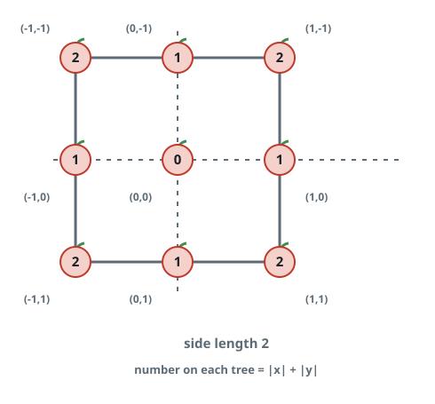

# Smallest Harvest Plot

## Description

Every integer coordinate `(i, j)` of an infinite orchard grid holds one
tree, and the tree there grows `|i| + |j|` apples, where `|x|` means `x`
itself when `x >= 0` and `-x` when `x < 0`.

You are buying a square plot: axis-aligned land centered on the origin,
whose apples — every fruit on or inside its boundary — are yours to
collect. Given `neededApples`, return the smallest perimeter a plot can
have while still holding at least that many apples.

### Example 1



```text
Input: neededApples = 1
Output: 8
Explanation: A plot with half-side 0 is just the origin and holds no
apples at all, since |0| + |0| = 0. Widening to half-side 1 sweeps in
12 apples, and the plot's perimeter is 2 * 4 = 8.
```

### Example 2

```text
Input: neededApples = 2024
Output: 64
Explanation: Half-side 7 yields 1680 apples — short of the target — while
half-side 8 already yields 2448, so the perimeter is 8 * 8 = 64.
```

### Example 3

```text
Input: neededApples = 100000000000000
Output: 233920
```

### Constraints

- `1 <= neededApples <= 10¹⁵`

## Hints

### Hint 1

A centered square is pinned down by its half-side `k`; derive how many
apples the box `[-k, k]²` holds as a function of `k` alone.

### Hint 2

The total grows monotonically with `k`, so the half-side can be found by
searching rather than scanning every value.
