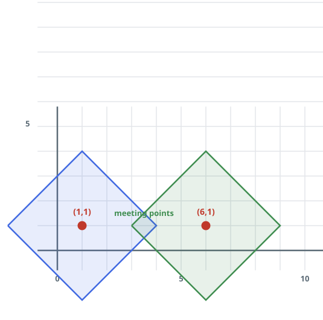
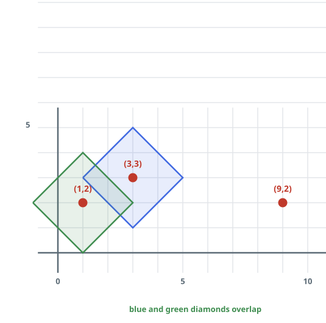
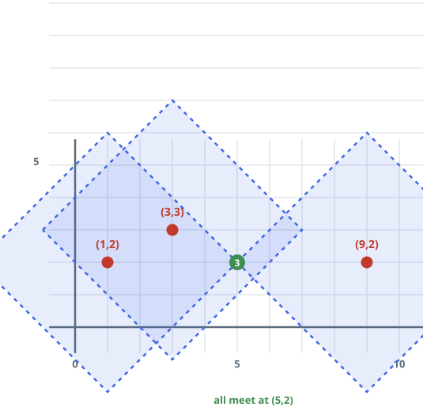

# Outbreak Overlap Days

## Description

An infinite 2D grid plays host to `n` distinct virus strains, launched
simultaneously on day 0: `points[i] = [xi, yi]` gives the starting cell of
the `i`th strain. Two strains may even start in the same cell.

Infection spreads by expansion: on each day, every already-infected cell
passes each strain it carries to its four orthogonal neighbors, and
co-located strains never interfere with one another's spread.

Given `k`, return the first day on which some single cell holds at least
`k` different strains.

### Example 1



```text
Input: points = [[1,1],[6,1]], k = 2
Output: 3
Explanation: The strains advancing from (1,1) and (6,1) meet in the
middle; by day 3 the cells (3,1) and (4,1) carry both. Those are not the
only shared cells by then.
```

### Example 2



```text
Input: points = [[3,3],[1,2],[9,2]], k = 2
Output: 2
Explanation: The first two origins sit close together: by day 2 the cells
(1,3), (2,3), (2,2), and (3,2) already hold both of them.
```

### Example 3



```text
Input: points = [[3,3],[1,2],[9,2]], k = 3
Output: 4
Explanation: Covering all three strains takes longer — day 4 is the first
day the cell (5,2) holds the complete set.
```

### Example 4

```text
Input: points = [[2,9],[14,3]], k = 2
Output: 9
Explanation: The two origins are a Manhattan distance of 18 apart, and
fronts advancing toward each other cover 2 cells per day, so they first
share cells on day 9.
```

### Constraints

- `n == points.length`
- `2 <= n <= 50`
- `points[i].length == 2`
- `1 <= xi, yi <= 100`
- `2 <= k <= n`

## Hints

### Hint 1

With at most 50 origins and coordinates at most 100, there are few cells
and few strains — a direct scan over candidate cells is affordable.

### Hint 2

A strain's reach after `t` days is a diamond (L1 ball) of radius `t`; the
question is where enough diamonds first overlap.
