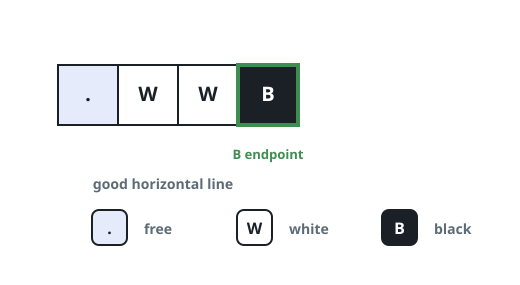
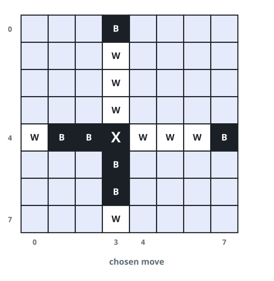
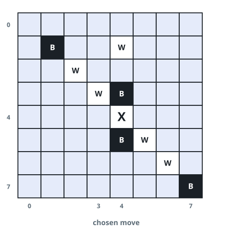

# Legal Placement Check

## Description

The board is an 8 x 8 grid, indexed from 0, where `board[r][c]` is the cell
at row `r` and column `c`. A cell holds `'W'` (white), `'B'` (black), or
`'.'` (empty).

Placing a piece of your color on an empty cell is allowed only when the
placement completes a good line — a horizontal, vertical, or diagonal
sequence of three or more cells whose two ends are your color while every
cell strictly between them is the opponent's, with no empty cell anywhere
in the sequence. Your new piece must be one of the two ends.

Given the board, a target empty cell `(rMove, cMove)`, and the `color`
you are playing, decide whether placing that color there is a legal move.



### Example 1



```text
Input: board = [[".",".",".","B",".",".",".","."],[".",".",".","W",".",".",".","."],[".",".",".","W",".",".",".","."],[".",".",".","W",".",".",".","."],["W","B","B",".","W","W","W","B"],[".",".",".","B",".",".",".","."],[".",".",".","B",".",".",".","."],[".",".",".","W",".",".",".","."]], rMove = 4, cMove = 3, color = "B"
Output: true
Explanation: The marked cell completes two good lines at once; along row 4
it turns the segment (4,3)-(4,7) into black ends sandwiching three white
pieces, and column 3 closes the same way toward the top.
```

### Example 2



```text
Input: board = [[".",".",".",".",".",".",".","."],[".","B",".",".","W",".",".","."],[".",".","W",".",".",".",".","."],[".",".",".","W","B",".",".","."],[".",".",".",".",".",".",".","."],[".",".",".",".","B","W",".","."],[".",".",".",".",".",".","W","."],[".",".",".",".",".",".",".","B"]], rMove = 4, cMove = 4, color = "W"
Output: false
Explanation: Some lines pass through the marked cell, but only through
their middle — no good line has the new white piece as an endpoint, so the
placement is rejected.
```

### Example 3

```text
Input: board = [["W","B",".",".",".",".",".","."],[".",".",".",".",".",".",".","."],[".",".",".",".",".",".",".","."],[".",".",".",".",".",".",".","."],[".",".",".",".",".",".",".","."],[".",".",".",".",".",".",".","."],[".",".",".",".",".",".",".","."],[".",".",".",".",".",".",".","."]], rMove = 0, cMove = 2, color = "W"
Output: true
Explanation: Scanning left from the new white piece, the black piece at
(0, 1) is followed by the white piece at (0, 0), closing a three-cell good
line along the row.
```

### Example 4

```text
Input: board = [[".","W",".",".",".",".",".","."],[".",".",".",".",".",".",".","."],[".",".",".",".",".",".",".","."],[".",".",".",".",".",".",".","."],[".",".",".",".",".",".",".","."],[".",".",".",".",".",".",".","."],[".",".",".",".",".",".",".","."],[".",".",".",".",".",".",".","."]], rMove = 0, cMove = 2, color = "B"
Output: false
Explanation: The run of white pieces toward the left never ends in a black
piece — the line runs into an empty cell, so nothing gets sandwiched.
```

### Constraints

- `board.length == board[r].length == 8`
- `0 <= rMove, cMove < 8`
- `board[rMove][cMove] == '.'`
- `color` is either `'B'` or `'W'`.

## Hints

### Hint 1

Treat the placed piece as an endpoint and test each of the eight rays
leaving it.

### Hint 2

Along a ray, the placement works exactly when some positive number of
opponent pieces is followed by a piece of your own color.
