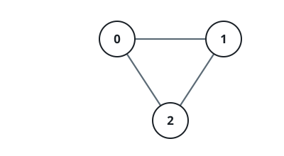
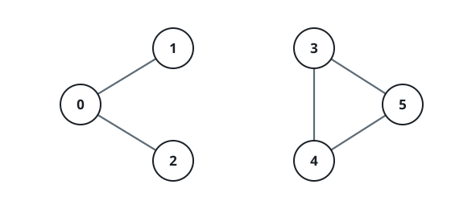

# Route Between Two Vertices

## Description

An undirected graph has `n` vertices numbered `0` through `n - 1`. Its
wiring is given by the array `edges`, where `edges[i] = [u, v]` records
that `u` and `v` are joined in both directions. No two vertices share
more than one edge, and no vertex is joined to itself.

Decide whether it is possible to travel from `source` to `destination`
by following edges of the graph. Return `true` if some route connects
the two vertices, and `false` if they lie in separate parts of the
graph.

### Example 1



```text
Input: n = 3, edges = [[0,1],[1,2],[2,0]], source = 0, destination = 2
Output: true
Explanation: Vertices 0, 1, and 2 form a triangle, so 0 reaches 2 both
directly and through 1.
```

### Example 2



```text
Input: n = 6, edges = [[0,1],[0,2],[3,5],[5,4],[4,3]], source = 0, destination = 5
Output: false
Explanation: The edges split the graph into the groups {0, 1, 2} and
{3, 4, 5}. The start and the goal sit in different groups, so no route
joins them.
```

### Example 3

```text
Input: n = 5, edges = [[0,1],[3,4]], source = 1, destination = 4
Output: false
Explanation: Vertex 1 is partnered with 0 and vertex 4 with 3, and the
two pairs never touch.
```

### Constraints

- `1 <= n <= 2 * 10⁵`
- `0 <= edges.length <= 2 * 10⁵`
- `edges[i].length == 2`
- `0 <= u, v <= n - 1`
- `u != v`
- All edges are distinct, and no edge joins a vertex to itself.
