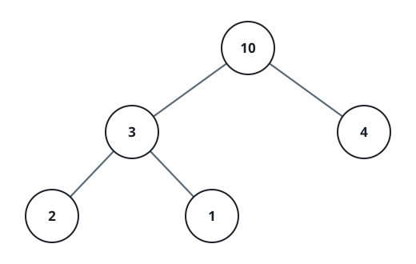
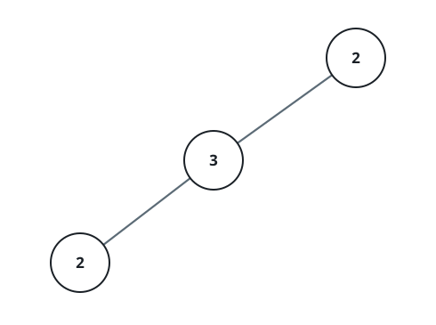

# Matching Descendant Sums

## Description

You are handed the `root` of a binary tree. Count the nodes whose own
value equals the total of every value stored strictly beneath them.

A node's descendants are the nodes lying below it — everyone along some
path from that node down to a leaf. A node with nothing beneath it has
a descendant total of `0`, so a leaf qualifies exactly when its value
is `0`.

Return how many nodes of the tree satisfy the match.

### Example 1



```text
Input: root = [10,3,4,2,1]
Output: 2
Explanation: The root 10 has 3+4+2+1 = 10 beneath it, and the node 3
has 2+1 = 3 beneath it. Those two nodes match; the rest do not.
```

### Example 2



```text
Input: root = [2,3,null,2,null]
Output: 0
Explanation: Every node's value differs from the total carried under
it, so no node qualifies.
```

### Example 3


```text
Input: root = [0]
Output: 1
Explanation: The lone leaf holds 0 with nothing beneath it, so it
counts.
```

### Constraints

- The tree holds between `1` and `10⁵` nodes.
- `0 <= Node.val <= 10⁵`

## Hints

### Hint 1

Recomputing each node's below-total from scratch repeats the same work
over and over. What a node needs is already contained in the totals of
its two children.

### Hint 2

Suppose every node knew the total of its own subtree. Then the total
beneath a node is that number minus its own value, and a single
bottom-up pass can hand every parent its subtree total.
