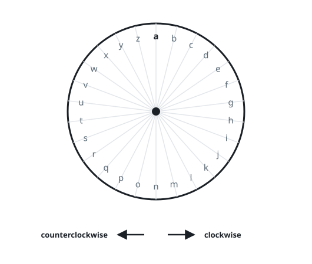

# Typing on a Circular Keyboard

## Description

The keyboard is a ring of the twenty-six lowercase letters `'a'` through
`'z'`, and a pointer rests on one letter at a time — starting on `'a'`.
A letter can only be typed while the pointer sits on it.

Each second is spent on exactly one of two moves:

- Turn the pointer one letter clockwise or counterclockwise.
- Type the letter currently under the pointer.



Return the fewest seconds in which the whole string `word` can be typed
out, in order.

### Example 1

```text
Input: word = "ab"
Output: 3
Explanation: The pointer already rests on 'a', so typing it takes one
second. One clockwise step reaches 'b', and typing it takes another
second.
```

### Example 2

```text
Input: word = "zy"
Output: 4
Explanation: Walking counterclockwise, 'z' is one step from 'a' and 'y'
is one step from 'z'; with one second per typed letter that is four
seconds in all.
```

### Example 3

```text
Input: word = "wud"
Output: 18
Explanation: Reaching 'w' costs 4 counterclockwise steps, 'u' is 2
steps on from 'w', and the long hop to 'd' is cheaper clockwise at 9
steps; adding one second per typed letter gives 18.
```

### Constraints

- `1 <= word.length <= 100`
- `word` consists of lowercase English letters.

## Hints

### Hint 1

Between any two letters of the ring there are exactly two ways to
travel: clockwise and counterclockwise.

### Hint 2

Taking whichever arc is shorter for each hop is always safe — either
arc ends on the same letter, so the choice affects nothing that comes
later.
