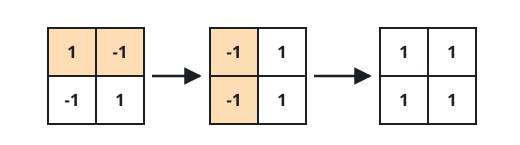
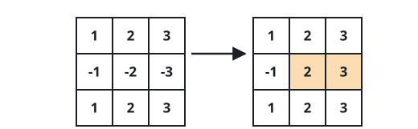

# Richest Possible Grid

## Description

You are given an `n x n` integer grid `matrix`. One operation picks two
cells that share a border and negates both of their values, and you may
run it as many times as you like.

Return the largest total the grid's entries can ever reach.

### Example 1



```text
Input: matrix = [[1,-1],[-1,1]]
Output: 4
Explanation: Negating the two entries of the first row and then the two
entries of the first column turns every value positive, and the total
climbs to 4.
```

### Example 2



```text
Input: matrix = [[1,2,3],[-1,-2,-3],[1,2,3]]
Output: 16
Explanation: Flipping the last two entries of the middle row lifts -2
and -3 to positive; after that every value contributes positively and
the total is 16.
```

### Constraints

- `n == matrix.length == matrix[i].length`
- `2 <= n <= 250`
- `-10⁵ <= matrix[i][j] <= 10⁵`

## Hints

### Hint 1

A flip carries a minus sign to a neighbouring cell without changing how
many minus signs there are — signs can be walked anywhere on the grid,
two cells at a time.

### Hint 2

When an odd number of entries begin negative, exactly one minus sign is
forced to survive, and the cheapest survivor is the entry of smallest
magnitude.
