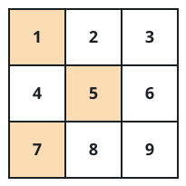
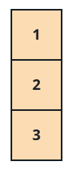
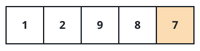

# Closest Achievable Sum

## Description

An `m x n` integer matrix `mat` and an integer `target` are given. Think
of each row as a menu: a valid selection takes exactly one value from
every row, and the selection's total is the sum of those `m` values.
Different selections usually land on different totals.

Among every selection the matrix allows, find the one whose total sits
closest to `target`, and return that smallest distance — the absolute
difference between the chosen total and `target`. (The absolute
difference of `a` and `b` is `|a - b|`.)

### Example 1



```text
Input: mat = [[1,2,3],[4,5,6],[7,8,9]], target = 13
Output: 0
Explanation: Picking `1`, `5`, and `7` from the three rows totals
exactly 13. The distance to the target is zero, and nothing can beat
zero.
```

### Example 2



```text
Input: mat = [[1],[2],[3]], target = 100
Output: 94
Explanation: Every row offers a single value, so the only selection
takes all of them and totals `1 + 2 + 3 = 6`. That leaves the target
`100 - 6 = 94` away.
```

### Example 3



```text
Input: mat = [[1,2,9,8,7]], target = 6
Output: 1
Explanation: With a single row the selection is just one value, and `7`
is the nearest value to `6`, giving distance `1`.
```

### Constraints

- `m == mat.length`
- `n == mat[i].length`
- `1 <= m, n <= 70`
- `1 <= mat[i][j] <= 70`
- `1 <= target <= 800`

## Hints

### Hint 1

Row values are small and there are few rows, so the grand total cannot
run away: as you sweep the rows, remember every total that is still
reachable after the rows seen so far.

### Hint 2

All values are positive, so a running total never decreases. Once a
partial total passes `target`, every extension of it drifts even
further past — among the overshooting totals only the smallest one can
ever win, which keeps the tracked set tight.
