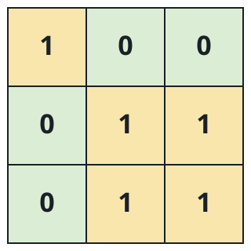
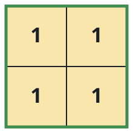
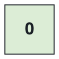

# Plots on the Survey Map

## Description

A survey map arrives as a 0-indexed `m x n` binary matrix `land`, where
`0` marks a hectare left wild and `1` marks a hectare planted. Planting
never happened at random: the planted hectares form disjoint rectangular
plots, and plots never touch — no planted hectare of one plot sits
four-directionally next to a planted hectare of another.

Indexing the map from the top-left corner `(0, 0)` down to
`(m-1, n-1)`, describe every plot by its two extreme corners. A plot
spanning from top-left `(r1, c1)` to bottom-right `(r2, c2)` is
reported as the four-element list `[r1, c1, r2, c2]`.

Return one such list per plot, gathered into a 2D array in any order;
if nothing on the map is planted, return an empty array.

### Example 1



```text
Input: land = [[1,0,0],[0,1,1],[0,1,1]]
Output: [[0,0,0,0],[1,1,2,2]]
Explanation: Two plots show on the map. One is the single hectare at
`land[0][0]`; the other is the `2 x 2` block whose top-left hectare is
`land[1][1]` and whose bottom-right hectare is `land[2][2]`.
```

### Example 2



```text
Input: land = [[1,1],[1,1]]
Output: [[0,0,1,1]]
Explanation: The whole map is one plot, stretching from `land[0][0]`
down to `land[1][1]`.
```

### Example 3



```text
Input: land = [[0]]
Output: []
Explanation: The single hectare is wild, so the map holds no plots.
```

### Constraints

- `m == land.length`
- `n == land[i].length`
- `1 <= m, n <= 300`
- Every entry of `land` is `0` or `1`.
- Planted hectares always form rectangles.

## Hints

### Hint 1

Because every plot is a rectangle, its top-left corner is the planted
hectare with the smallest row and column in the plot — and it is exactly
where a scan first meets the plot.

### Hint 2

The bottom-right corner carries the largest row and column of the plot,
so flooding the rectangle while remembering the extremes pins both
corners down.

### Hint 3

Walk the map once; at each unvisited planted hectare, flood-fill its
whole rectangle, record the extremes as the corners, and mark every
hectare seen so no plot is reported twice.
