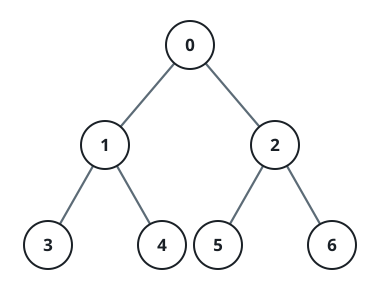

# The Lockable Tree

## Description

A tree of `n` nodes numbered `0` through `n - 1` is given as a parent
array: `parent[i]` is the `i`th node's parent, and the root is node `0`
with `parent[0] = -1`. Several users interact with the tree by locking
its nodes, and every node can hold at most one lock at a time.

Implement the `LockableTree` class:

- `LockableTree(int[] parent)` initializes the structure from the parent
  array.
- `lock(int num, int user)` lets the user with id `user` claim node `num`
  — allowed only while the node is unlocked — and returns whether the
  claim happened.
- `unlock(int num, int user)` releases node `num`, allowed only when it
  is currently locked by that same user, and returns whether the release
  happened.
- `upgrade(int num, int user)` — allowed only when all three hold: node
  `num` is unlocked, at least one of its descendants is locked (by
  anyone), and none of its ancestors is locked. It locks node `num` for
  `user` and unlocks every descendant, returning whether it happened.

### Example 1



```text
Input:
["LockableTree", "lock", "unlock", "unlock", "lock", "upgrade", "lock"]
[[[-1, 0, 0, 1, 1, 2, 2]], [2, 2], [2, 3], [2, 2], [4, 5], [0, 1], [0, 1]]
Output: [null, true, false, true, true, true, false]
Explanation:
LockableTree tree = new LockableTree([-1, 0, 0, 1, 1, 2, 2]);
tree.lock(2, 2);    // return true because node 2 is unlocked.
                    // Node 2 will now be locked by user 2.
tree.unlock(2, 3);  // return false because user 3 cannot unlock a node locked by user 2.
tree.unlock(2, 2);  // return true because node 2 was previously locked by user 2.
                    // Node 2 will now be unlocked.
tree.lock(4, 5);    // return true because node 4 is unlocked.
                    // Node 4 will now be locked by user 5.
tree.upgrade(0, 1); // return true because node 0 is unlocked and has at least one locked descendant (node 4).
                    // Node 0 will now be locked by user 1 and node 4 will now be unlocked.
tree.lock(0, 1);    // return false because node 0 is already locked.
```

### Constraints

- `n == parent.length`
- `2 <= n <= 2000`
- `0 <= parent[i] <= n - 1` for `i != 0`
- `parent[0] == -1`
- `0 <= num <= n - 1`
- `1 <= user <= 10⁴`
- `parent` always describes a valid tree.
- At most `2000` calls in total are made to `lock`, `unlock`, and
  `upgrade`.

## Hints

### Hint 1

The limits are small enough that a lock check may walk — you only need
the walks to be correct.

### Hint 2

A node's ancestors are reached by following `parent` upward; its
descendants by sweeping the whole array or searching downward from it.
