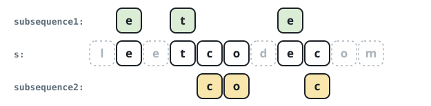

# Palindrome Pair Product

## Description

You are given a string `s`. Pick two palindromic subsequences of `s` that
stay out of each other's way: a position taken by one pick is unavailable to
the other. Score the pair as the product of the two lengths, and make that
product as large as you can.

Return the largest achievable product.

A subsequence keeps the left-to-right order of the characters it retains, and
a string reads as a palindrome when it is identical forward and backward.

### Example 1



```text
Input: s = "leetcodecom"
Output: 9
Explanation: Take "ete" as the first pick and "cdc" as the second. They use
no common position, and 3 * 3 = 9.
```

### Example 2

```text
Input: s = "abc"
Output: 1
Explanation: All three characters differ, so neither pick can extend past a
single letter and the best product is 1 * 1.
```

### Example 3

```text
Input: s = "aabb"
Output: 4
Explanation: Pick "aa" for the first subsequence and "bb" for the second;
the positions are disjoint and 2 * 2 = 4.
```

### Constraints

- `2 <= s.length <= 12`
- `s` contains only lowercase English letters.

## Hints

### Hint 1

A string of length at most 12 has only `3^n` ways to hand each position to
the first pick, the second pick, or neither — small enough to search
directly.

### Hint 2

Precompute, for every subset of positions, the length of the subsequence it
spells when that subsequence is a palindrome. For each palindromic subset,
hunt for a palindromic subset of the positions left over.
