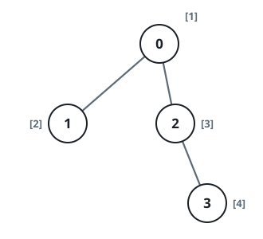
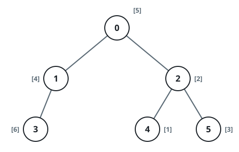

# Smallest Absent Gene Per Subtree

## Description

A family tree is rooted at node `0` and spans `n` nodes numbered `0` through
`n - 1`. The array `parents` describes the shape: `parents[i]` is node `i`'s
parent, and the root satisfies `parents[0] == -1`.

Every node carries its own gene value: the array `nums` gives `nums[i]` for
node `i`, and all gene values are distinct integers drawn from `1` through
`10⁵`.

For every node `i`, look at the subtree hanging below it — the node itself
plus every descendant — and find the smallest gene value from the range that
nowhere appears in it. Return all `n` of these smallest absent values as an
array.

### Example 1



```text
Input: parents = [-1,0,0,2], nums = [1,2,3,4]
Output: [5,1,1,1]
Explanation: Working node by node — node 0 gathers values [1,2,3,4] from its
whole tree, so 5 is the first gap; every other subtree avoids value 1 and
answers 1.
```

### Example 2



```text
Input: parents = [-1,0,1,0,3,3], nums = [5,4,6,2,1,3]
Output: [7,1,1,4,2,1]
Explanation: The full tree misses 7, node 3's group {2,1,3} misses 4, and
node 4's lone value 1 pushes its own answer to 2; the remaining subtrees all
still lack 1.
```

### Example 3

```text
Input: parents = [-1,0,0,1], nums = [4,2,5,1]
Output: [3,3,1,2]
Explanation: Node 3 holds value 1, so it answers 2; node 1 and the root
above it collect {1,2,4,5} and answer 3; node 2 with value 5 still misses 1.
```

### Constraints

- `n == parents.length == nums.length`
- `2 <= n <= 10⁵`
- `0 <= parents[i] <= n - 1` whenever `i != 0`, and `parents[0] == -1`
- `parents` forms a valid tree.
- `1 <= nums[i] <= 10⁵`, and all values in `nums` are distinct.

## Hints

### Hint 1

Any subtree that does not contain the value 1 answers 1 immediately, so only
the node carrying 1 and its ancestors need real work.

### Hint 2

Walk upward from the value-1 node, folding each new subtree into a shared
"seen" structure, and advance a running candidate whenever it has been seen.
