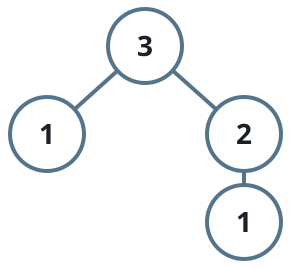
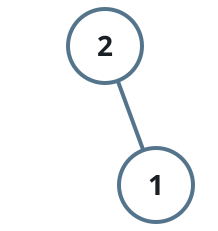

# Fibonacci Tree Pruning Game

## Description

Build a binary tree from the recursion `order(n)`:

- `order(0)` is no tree at all.
- `order(1)` is a single node.
- For larger `n`, `order(n)` is a root whose left subtree is `order(n - 2)`
  and whose right subtree is `order(n - 1)`.

Alice moves first in a pruning game played on `order(n)`. A move picks any
remaining node and cuts it away together with everything below it, and the
player who has no choice but to cut the root loses the game.

Given `n`, return `true` when Alice wins under perfect play and `false` when
Bob does.

### Example 1



```text
Input: n = 3
Output: true
Explanation: Alice opens by cutting the upper node of the right side.
Whatever Bob answers with on the remaining branches, Alice mirrors him on
the other one, and Bob is the one who must eventually cut the root.
```

### Example 2


```text
Input: n = 1
Output: false
Explanation: The tree is a single node, so Alice's first move is forced to
be the root and she loses at once.
```

### Example 3



```text
Input: n = 2
Output: true
Explanation: Alice removes the child of the root; Bob is then left holding
only the root and loses.
```

### Constraints

- `1 <= n <= 100`

## Hints

### Hint 1

Treat each node's position as an independent game and combine the children
with the standard impartial-game addition.

### Hint 2

The value of one node works out to one more than the exclusive-or of its two
children's values, and only the two previous orders are ever needed.

### Hint 3

Scan the orders from 0 upward, keeping the last two outcomes, and the final
exclusive-or of the root's children decides the winner.
