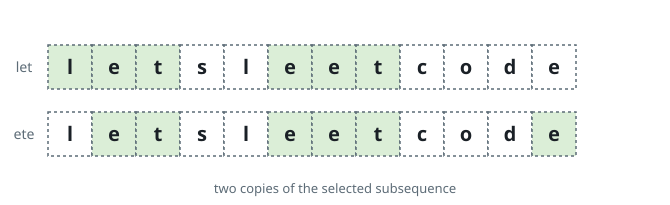

# Longest k-Fold Subsequence

## Description

A subsequence of `s` is what remains after deleting zero or more characters of
`s` without reordering those that stay. A subsequence `t` is called
**k-fold** when `t` written `k` times in a row is itself a subsequence of
`s`. For instance, `"ab"` is 2-fold in `"abcabb"`, because `"abab"` can be
traced through that string in order.

Given the string `s` of length `n` and an integer `k`, return the longest
k-fold subsequence of `s`. If several subsequences share the greatest length,
return the lexicographically largest of them, and return the empty string if
no nonempty subsequence is k-fold.

### Example 1



```text
Input: s = "letsleetcode", k = 2
Output: "let"
Explanation: Two units of length 3 are 2-fold here, "let" and "ete". The
answer is "let", the lexicographically larger of the two.
```

### Example 2

```text
Input: s = "acbbacb", k = 2
Output: "acb"
Explanation: The letters a, c, b appear in order twice — once at the start and
once in the last three positions — and no unit longer than 3 exists, since
doubling any such unit would need more than the string holds of some letter.
```

### Example 3

```text
Input: s = "xyz", k = 3
Output: ""
Explanation: No letter occurs three times, so not even a single-character
unit is 3-fold, and the empty string is returned.
```

### Constraints

- `n == s.length`
- `2 <= k <= 2000`
- `2 <= n < min(2001, k * 8)`
- `s` contains only lowercase English letters.

## Hints

### Hint 1

Each letter can appear in a unit at most `count / k` times, so a unit's length
never exceeds `n / k`. Search only candidates that respect those per-letter
budgets.

### Hint 2

Grow a unit one letter at a time, trying larger letters first, and scan `s`
after each extension to count the complete copies it carves out. Extend only
while the unit still succeeds — every prefix of a working unit works too.
