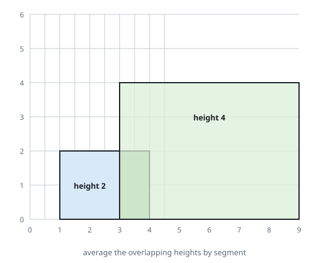

# Street Height Profile

## Description

Buildings line a straight street modelled as a number line. Each row of the
array `buildings` is `[start, end, height]`: a building of that height stands
on the half-closed stretch `[start, end)`, which includes `start` but stops
just short of `end`.

Summarize the occupied street as a list of half-closed segments, as few of
them as possible. A segment is written `[left, right, avg]`, where `avg` is
the integer average of the building heights covering `[left, right)` — the
total of those heights divided, using integer division, by how many buildings
stand there. Two neighboring stretches may share a segment when their integer
averages are equal; stretches with no building at all are omitted entirely.

Return the segments ordered left to right by increasing left endpoint.

### Example 1



```text
Input: buildings = [[1,4,2],[3,9,4]]
Output: [[1,3,2],[3,4,3],[4,9,4]]
Explanation: From 1 to 3 only the first building stands, average 2 / 1 = 2.
From 3 to 4 both stand, average (2 + 4) / 2 = 3. From 4 to 9 only the second
stands, average 4 / 1 = 4.
```

### Example 2

```text
Input: buildings = [[2,6,3],[4,9,3]]
Output: [[2,9,3]]
Explanation: The number of standing buildings changes at 4 and again at 6,
but the integer average is 3 on every stretch, so the whole occupied run
merges into one segment.
```

### Example 3

```text
Input: buildings = [[0,4,5],[2,7,1]]
Output: [[0,2,5],[2,4,3],[4,7,1]]
Explanation: Only the first building covers 0 to 2, average 5. Both cover 2
to 4, average (5 + 1) / 2 = 3. Only the second covers 4 to 7, average 1.
```

### Example 4

```text
Input: buildings = [[1,3,4],[7,9,4]]
Output: [[1,3,4],[7,9,4]]
Explanation: Both stretches average 4, yet the building-free gap between them
keeps the output as two separate segments.
```

### Constraints

- `1 <= buildings.length <= 10⁵`
- `buildings[i].length == 3`
- `0 <= buildings[i][0] < buildings[i][1] <= 10⁸`
- `1 <= buildings[i][2] <= 10⁵`

## Hints

### Hint 1

An average can only change where a building starts or ends — those are the
only coordinates worth looking at.

### Hint 2

Record a height-and-count increase at every start and the matching decrease at
every end, then sweep the sorted coordinates; between two consecutive
coordinates the coverage is constant, so a stretch's segment is one integer
division away.
