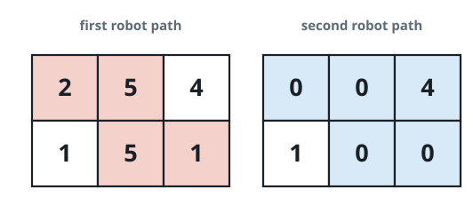
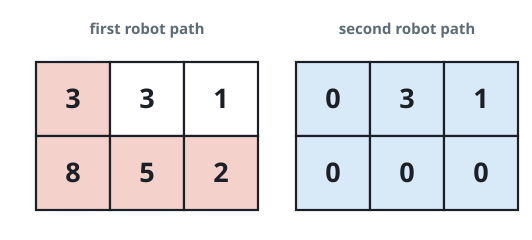
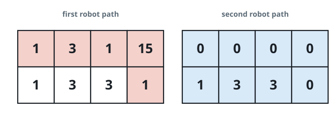

# Grid Duel

## Description

A board is a `2 x n` grid; `grid[r][c]` holds the point value of cell
`(r, c)`. Two players each travel from `(0, 0)` down to `(1, n - 1)`, and a
step is either one cell right (`(r, c)` to `(r, c + 1)`) or one cell down
(`(r, c)` to `(r + 1, c)`).

First player walks their whole path and gathers the points of every cell on
it; each visited cell then drops to `0`. Second player then walks any path
they like and gathers what remains. Paths are allowed to cross.

First player aims to leave second player as little as possible; second
player then picks the richest path still open. Assuming both play
optimally, output how many points second player ends up with.

### Example 1



```text
Input: grid = [[2,5,4],[1,5,1]]
Output: 4
Explanation: The red path is first player's best route; after it zeroes the
cells it touches, the blue path is second player's best reply, worth
0 + 0 + 4 + 0 = 4 points.
```

### Example 2



```text
Input: grid = [[3,3,1],[8,5,2]]
Output: 4
Explanation: Along the red route first player's sweep zeroes the cells it
crosses, and the best remaining route (blue) nets 0 + 3 + 1 + 0 = 4.
```

### Example 3



```text
Input: grid = [[1,3,1,15],[1,3,3,1]]
Output: 7
Explanation: After the red route zeroes its cells, the blue route collects
0 + 1 + 3 + 3 + 0 = 7, and nothing first player can do holds second player
below that.
```

### Constraints

- `grid.length == 2`
- `n == grid[r].length`
- `1 <= n <= 5 * 10⁴`
- `1 <= grid[r][c] <= 10⁵`

## Hints

### Hint 1

The only real decision is the column where first player drops from the top
row to the bottom row — there are `n` possibilities.

### Hint 2

For a fixed drop column, prefix sums tell you instantly what each player
can still reach: compare what survives to the right on top against what
survives to the left on the bottom.
