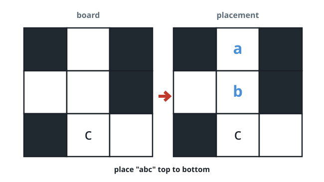
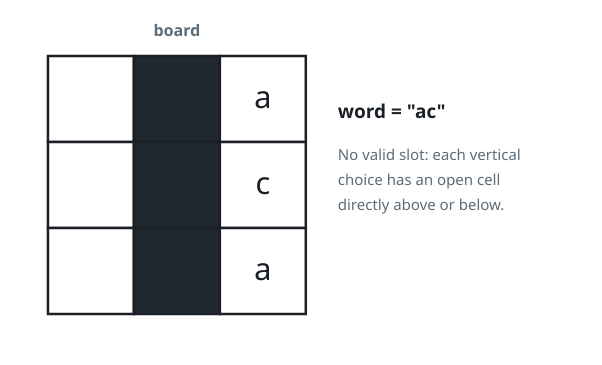
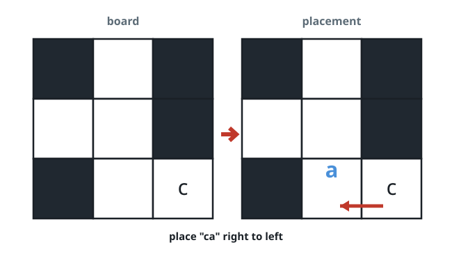

# Slot the Word

## Description

You hold an `m x n` grid `board` showing a puzzle mid-solve. Cells hold
either a settled lowercase letter, `' '` for an open slot, or `'#'` for a
walled-off cell.

The word may be laid across the grid horizontally (read left-to-right or
right-to-left) or down it vertically (read top-to-bottom or
bottom-to-top). A placement is legal exactly when:

- No letter of the word lands on a `'#'` cell.
- Each letter either lands on `' '` or agrees with the letter already in
  that cell.
- A horizontal placement may not touch any `' '` or lowercase cell
  immediately before its first letter or after its last.
- A vertical placement may not touch any `' '` or lowercase cell
  immediately above its first letter or below its last.

Decide whether `word` has at least one legal placement; answer `true` if
so and `false` otherwise.

### Example 1



```text
Input: board = [["#", " ", "#"], [" ", " ", "#"], ["#", "c", " "]], word = "abc"
Output: true
Explanation: Reading top to bottom, the open third column accepts a, b, c
as drawn above.
```

### Example 2



```text
Input: board = [[" ", "#", "a"], [" ", "#", "c"], [" ", "#", "a"]], word = "ac"
Output: false
Explanation: Wherever "ac" goes, an open cell or a letter ends up directly
adjacent to one of its ends, so no legal slot exists.
```

### Example 3



```text
Input: board = [["#", " ", "#"], [" ", " ", "#"], ["#", " ", "c"]], word = "ca"
Output: true
Explanation: Laid right to left along the middle row, "ca" fits the two
open cells exactly as shown.
```

### Constraints

- `m == board.length`
- `n == board[i].length`
- `1 <= m * n <= 2 * 10⁵`
- `board[i][j]` is `' '`, `'#'`, or a lowercase English letter.
- `1 <= word.length <= max(m, n)`
- `word` consists only of lowercase English letters.

## Hints

### Hint 1

Every candidate placement lives inside a maximal stretch of non-`'#'`
cells, so enumerate those stretches.

### Hint 2

A stretch can host the word only if it is exactly as long as the word, and
its fixed letters must agree with the word forwards or backwards.
