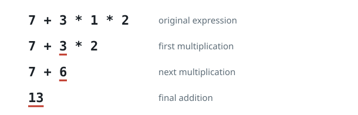

# Grading Expression Answers

## Description

The string `s` holds a valid arithmetic expression built from single-digit
operands and the operators `+` and `*` only (for instance, `3+5*2`). A class
of `n` pupils evaluated it, but they were told to apply operations in this
order:

- Multiply, working left to right; then
- Add, working left to right.

The array `answers` of length `n` lists what the pupils submitted, in no
particular order. Award points as follows:

- An answer equal to the expression's true value earns 5 points.
- Any other answer that can be produced by evaluating the same expression
  with a different parenthesization — right arithmetic, wrong precedence —
  earns 2 points.
- Every other answer earns 0 points.

Output the total points awarded.

### Example 1



```text
Input: s = "7+3*1*2", answers = [20,13,42]
Output: 7
Explanation: The true value is 13, so that pupil earns 5 points.
Grouping the addition first — ((7+3)*1)*2 — yields 20 with correct
arithmetic, earning 2 points. The tally is [2,5,0], summing to 7.
```

### Example 2

```text
Input: s = "2*3+4", answers = [14,10,14]
Output: 9
Explanation: The true value is 10, worth 5 points. Doing the addition first,
2*(3+4) = 14, which is a valid wrong-precedence result worth 2 points each.
The tally is [2,5,2], summing to 9.
```

### Example 3

```text
Input: s = "4*1+2", answers = [12,6,7]
Output: 7
Explanation: The true value is 6, worth 5 points. Grouping as 4*(1+2) gives
12, a wrong-precedence result worth 2 points. The stray 7 earns nothing.
The tally is [2,5,0], summing to 7.
```

### Example 4

```text
Input: s = "1+2*3+2", answers = [11,9,15,11]
Output: 11
Explanation: The true value is 9, worth 5 points. (1+2)*3+2 = 11 and
(1+2)*(3+2) = 15 are both legal regroupings with correct arithmetic, so
each of those submissions earns 2 points. The tally is [2,5,2,2], summing
to 11.
```

### Constraints

- `3 <= s.length <= 31`
- `s` is a valid expression over the digits `0-9`, `+`, and `*`.
- Every operand is a single digit from `0` to `9`.
- The expression contains between `1` and `15` operators, inclusive.
- The true value of the expression lies in the inclusive range `[0, 1000]`.
- Intermediate multiplication results never exceed `10⁹`.
- `n == answers.length`
- `1 <= n <= 10⁴`
- `0 <= answers[i] <= 1000`

## Hints

### Hint 1

With so few operators, enumerate every value the expression can take under
any parenthesization, then grade against that collection.

### Hint 2

Split the operand sequence at each operator and memoize the set of values
each span can produce.

### Hint 3

Bound the stored values by the answer cap of `1000` to keep the sets small.
