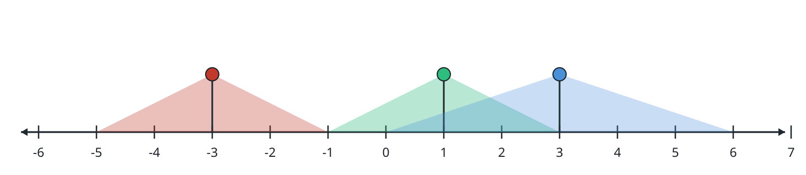

# Best-Lit Point

## Description

Model a street as a number line carrying lamps, described by the 2D integer
array `lights`. Entry `lights[i] = [positionᵢ, rangeᵢ]` says one lamp sits at
`positionᵢ` and illuminates the closed interval
`[positionᵢ - rangeᵢ, positionᵢ + rangeᵢ]`.

Call a position `p`'s brightness the count of lamps whose interval contains
`p`.

Given `lights`, return a brightest position on the street; when several
positions tie for the maximum brightness, return the smallest of them.

### Example 1



```text
Input: lights = [[-3,2],[1,2],[3,3]]
Output: -1
Explanation: The lamps cover [-5,-1], [-1,3], and [0,6] respectively.
Position -1 is lit by the first two lamps, and each of positions 0 through 3
is lit by the last two — brightness 2 either way, and -1 is the smallest of
these maxima.
```

### Example 2

```text
Input: lights = [[4,1],[6,2]]
Output: 4
Explanation: The lamps cover [3,5] and [4,8]. The overlap [4,5] has
brightness 2, and 4 is the smaller of its two positions.
```

### Example 3

```text
Input: lights = [[0,0]]
Output: 0
Explanation: The single lamp covers only [0,0], where brightness is 1.
```

### Constraints

- `1 <= lights.length <= 10⁵`
- `lights[i].length == 2`
- `-10⁸ <= positionᵢ <= 10⁸`
- `0 <= rangeᵢ <= 10⁸`

## Hints

### Hint 1

Turn each lamp into its illuminated interval and think in terms of the
endpoints of those intervals rather than individual positions.

### Hint 2

Brightness only changes at an interval boundary — never between two
consecutive boundaries.

### Hint 3

A sweep over the sorted boundaries with a running counter finds the maximum
without visiting any interior position.
