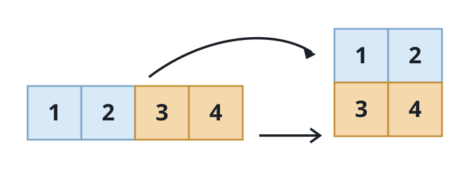

# Repack into a Grid

## Description

Given a 0-indexed flat integer array `original` plus two integers `m` and
`n`, build an `m`-by-`n` grid that consumes every element of `original`.

The fill order is row-major: the first `n` elements (`original[0]` through
`original[n - 1]`) become row 0, the next `n` elements become row 1, and so
on.

Return the resulting `m x n` grid. If the element count cannot match an
`m`-by-`n` shape, return an empty 2D array.

### Example 1



```text
Input: original = [1,2,3,4], m = 2, n = 2
Output: [[1,2],[3,4]]
Explanation: A 2x2 grid needs exactly 4 elements. The first pair [1,2]
fills the top row and the second pair [3,4] fills the bottom row.
```

### Example 2

```text
Input: original = [9,7,5,3,1], m = 1, n = 5
Output: [[9,7,5,3,1]]
Explanation: One row of five columns takes all five elements in order.
```

### Example 3

```text
Input: original = [10,20,30,40,50,60], m = 3, n = 2
Output: [[10,20],[30,40],[50,60]]
Explanation: Elements are dealt two at a time into three rows.
```

### Example 4

```text
Input: original = [2,4,6,8], m = 3, n = 2
Output: []
Explanation: A 3x2 grid needs 6 elements, but `original` has only 4, so the
repack is impossible.
```

### Constraints

- `1 <= original.length <= 5 * 10⁴`
- `1 <= original[i] <= 10⁵`
- `1 <= m, n <= 4 * 10⁴`

## Hints

### Hint 1

Count cells: the repack works only when `m * n` equals the length of
`original`.

### Hint 2

When the shape fits, cell `(row, column)` of the grid is just
`original[row * n + column]`.
