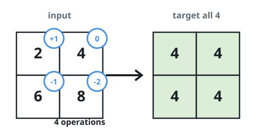
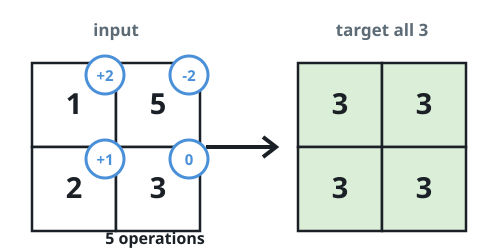
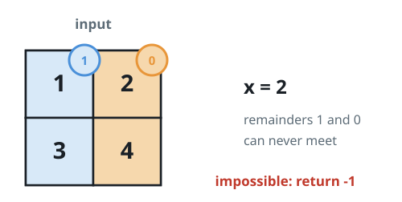

# Steps to Level a Grid

## Description

You are given an `m x n` integer `grid` and an integer `x`. One move picks
any cell and either adds `x` to it or subtracts `x` from it.

The grid is level once every cell holds the same value. Return the smallest
number of moves that levels the whole grid, or `-1` if no sequence of moves
can get there.

### Example 1



```text
Input: grid = [[2,4],[6,8]], x = 2
Output: 4
Explanation: Raising the 2 once and lowering 6 once and 8 twice leaves the
grid equal to 4 — four moves in total.
```

### Example 2



```text
Input: grid = [[1,5],[2,3]], x = 1
Output: 5
Explanation: With x = 1 any cell can reach any value; parking everything at
3 costs five moves.
```

### Example 3



```text
Input: grid = [[1,2],[3,4]], x = 2
Output: -1
Explanation: Odd and even cells can never meet, so the grid cannot be
leveled.
```

### Constraints

- `m == grid.length`
- `n == grid[i].length`
- `1 <= m, n <= 10⁵`
- `1 <= m * n <= 10⁵`
- `1 <= x, grid[i][j] <= 10⁴`

## Hints

### Hint 1

Adding or subtracting `x` never changes a value's remainder modulo `x`. What
does that imply for two cells whose remainders differ?

### Hint 2

When every value shares one remainder class, each move closes exactly one
unit of the normalized distance `|a - b| / x`. Which single target value
keeps the total distance shortest?

### Hint 3

Sort the flattened values and try the middle one.
