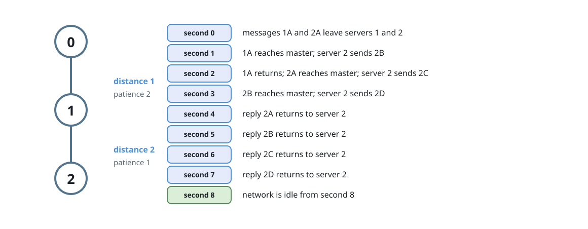
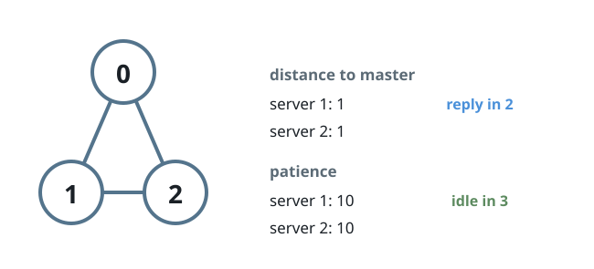

# When the Chatter Stops

## Description

A network links `n` servers numbered `0` to `n - 1`. The 2D array `edges`
describes the wiring: each `edges[i] = [ui, vi]` is a channel letting
servers `ui` and `vi` pass messages to each other directly in one second.
The array `patience` of length `n` is also given, and the network is
connected, so any server can reach any other through some chain of channels.

Server `0` is the master; every other server is a data server that expects
the master to process its message. Messages always travel along shortest
routes, and the master answers each arrival instantly, sending the reply
back along the same route in reverse.

At the start of second 0 every data server sends its message. From second 1
onward, each data server checks at the start of every second whether a reply
has reached it yet (newly arrived replies count). If not, server `i`
re-sends its message once `patience[i]` seconds have passed since its most
recent send. Once a reply arrives, that server falls silent for good.

The network is idle at a second when no message is in transit and none
arrives. Return the earliest second from which the network stays idle.

### Example 1



```text
Input: edges = [[0,1],[1,2]], patience = [0,2,1]
Output: 8
Explanation: Server 1 sits one hop away, so its message returns at second 2
— well within its patience, and it never re-sends. Server 2 sits two hops
away and re-sends every second; its final message leaves at second 3 and the
reply lands at second 7. From second 8 the channels are empty.
```

### Example 2



```text
Input: edges = [[0,1],[0,2],[1,2]], patience = [0,10,10]
Output: 3
Explanation: Both data servers are one hop from the master, so each reply
arrives at the start of second 2 — long before either server's patience
runs out. From second 3 the network is idle.
```

### Constraints

- `n == patience.length`
- `2 <= n <= 10⁵`
- `patience[0] == 0`
- `1 <= patience[i] <= 10⁵ for 1 <= i < n`
- `1 <= edges.length <= min(10⁵, n * (n - 1) / 2)`
- `edges[i].length == 2`
- `0 <= ui, vi < n`
- `ui != vi`
- There are no duplicate edges.
- Every server can reach every other server directly or indirectly.

## Hints

### Hint 1

Breadth-first search from the master gives each data server's one-way travel
time. Combine that with a server's patience to find when it sends its final
message.

### Hint 2

The last message a server ever sends arrives back one round trip after it
leaves.

### Hint 3

A server re-sends only at patience multiples that fall strictly before its
first reply arrives — count how many sends that allows.
