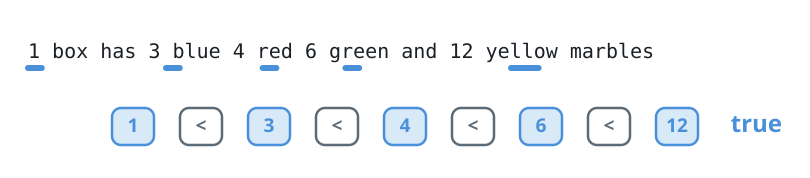
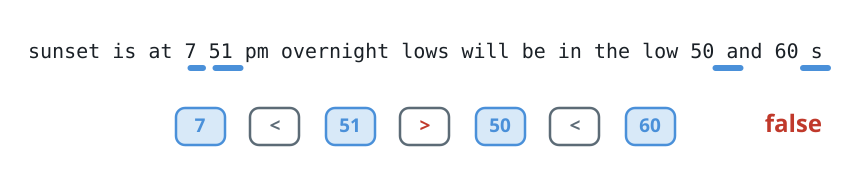

# Rising Numbers in a Sentence

## Description

A sentence arrives as tokens separated by single spaces, with no space at
either end. Each token is one of two things: a positive integer written in
plain digits with no leading zeros, or a word made only of lowercase English
letters.

Given such a sentence `s`, decide whether every number appearing in it is
strictly larger than the number before it when read left to right. Words
carry no value here; only the numeric tokens matter.

Return `true` if the numbers form a strictly increasing sequence, and
`false` otherwise.

### Example 1



```text
Input: s = "1 box has 3 blue 4 red 6 green and 12 yellow marbles"
Output: true
Explanation: The sentence contains the numbers 1, 3, 4, 6 and 12, in that
order. Each one exceeds the last, so the sequence is strictly increasing.
```

### Example 2

```text
Input: s = "she swam 12 laps then 12 more"
Output: false
Explanation: The two numbers are both 12. Strictly increasing requires each
number to surpass the previous one, so equal neighbors fail the check.
```

### Example 3



```text
Input: s = "sunset is at 7 51 pm overnight lows will be in the low 50 and 60 s"
Output: false
Explanation: Reading left to right, the numbers are 7, 51, 50 and 60. The
drop from 51 to 50 breaks the pattern.
```

### Constraints

- `3 <= s.length <= 200`
- `s` contains only lowercase English letters, spaces, and the digits `0`
  through `9`.
- The sentence holds between `2` and `100` tokens, separated by exactly one
  space, with no leading or trailing spaces.
- At least two of the tokens are numbers.
- Every number in `s` is positive, smaller than `100`, and written without
  leading zeros.

## Hints

### Hint 1

Splitting the sentence on spaces yields the tokens, and under the sentence
rules a token whose first character is a digit is one of the numbers.

### Hint 2

Scan the tokens once, converting each numeric one, and remember the last
number seen. Any value that fails to beat that memory means the answer is
`false`.
