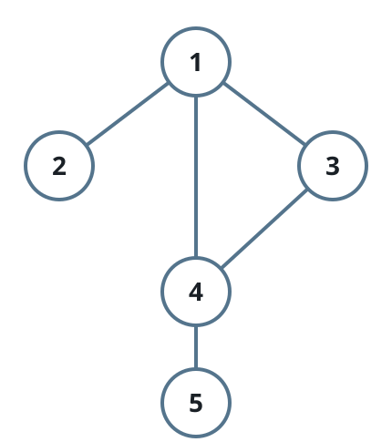
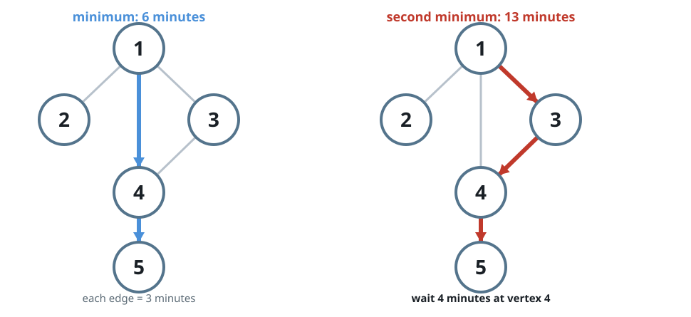
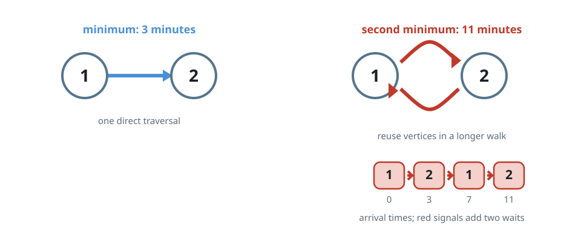

# Second-Fastest Arrival

## Description

Model a city as a connected undirected graph on `n` intersections numbered
`1` through `n`. The road list `edges` contains one entry per road:
`edges[i] = [ui, vi]` joins intersections `ui` and `vi` in both directions.
No two roads connect the same pair, and no road loops back to its own
intersection. Driving down any single road takes exactly `time` minutes.

Every intersection carries a traffic signal that flips between green and red
every `change` minutes, and all signals flip in sync. You may arrive at an
intersection at any moment, but you may only depart while its signal is
green — and while the signal is green you must leave at once rather than
wait.

Recall how a second minimum is defined: the smallest value that is strictly
larger than the minimum.

- The second minimum of `[2, 3, 4]` is `3`; the second minimum of `[2, 2, 4]` is `4`.

Report the second minimum travel time for a trip that starts at intersection
`1` and ends at intersection `n`.

Notes:

- Every intersection may be visited any number of times, including
  intersections `1` and `n`.
- All signals have just turned green the moment the trip begins.

### Example 1





```text
Input: n = 5, edges = [[1,2],[1,3],[1,4],[3,4],[4,5]], time = 3, change = 5
Output: 13
Explanation:
The fastest trip takes 6 minutes: drive 1 -> 4 (elapsed 3) and then
4 -> 5 (elapsed 6), catching every green light along the way.

The second-fastest arrival needs 13 minutes. Drive 1 -> 3 (elapsed 3), then
3 -> 4 (elapsed 6), sit out the red phase at 4 until minute 10, and finish
with 4 -> 5 at minute 13.
```

### Example 2



```text
Input: n = 2, edges = [[1,2]], time = 3, change = 2
Output: 11
Explanation:
The only two-edge trip, 1 -> 2, arrives after 3 minutes and is the fastest.

Backtracking once gives the second-fastest trip 1 -> 2 -> 1 -> 2, which
dodges two red phases and reaches intersection 2 at minute 11.
```

### Constraints

- `2 <= n <= 10⁴`
- `n - 1 <= edges.length <= min(2 * 10⁴, n * (n - 1) / 2)`
- `edges[i].length == 2`
- `1 <= ui, vi <= n`
- `ui != vi`
- No road appears twice in `edges`.
- The graph is connected: every intersection reaches every other.
- `1 <= time, change <= 10³`

## Hints

### Hint 1

All roads cost the same and all signals share one schedule, so the clock
reading at a vertex depends only on how many roads were traveled — the
signal timings can be ignored while searching.

### Hint 2

Once you know the second-smallest road count to reach `n`, one direct
simulation of that many crossings, waiting out red lights, yields the
answer.
