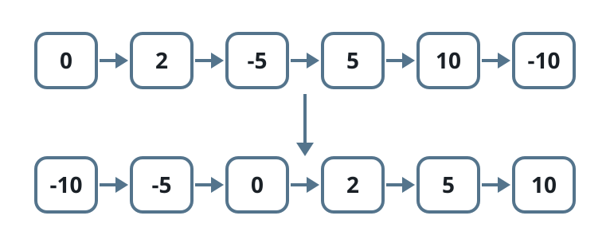
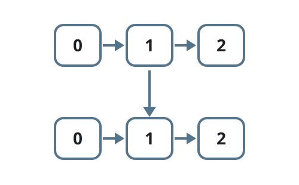

# Reorder an Absolute-Sorted List

## Description

You are given the `head` of a singly linked list whose nodes are in
non-decreasing order when compared by absolute value. Rearrange the list so
that the node values themselves come out in non-decreasing order, and return
its new `head`.

### Example 1



```text
Input: head = [0,2,-5,5,10,-10]
Output: [-10,-5,0,2,5,10]
Explanation:
Read by absolute value the chain 0, 2, 5, 5, 10, 10 never decreases, which
is why the input is built as [0,2,-5,5,10,-10]. Read by the stored values
the same nodes must come out as [-10,-5,0,2,5,10].
```

### Example 2



```text
Input: head = [0,1,2]
Output: [0,1,2]
Explanation:
With no negative values anywhere, the value order already matches the
absolute-value order, so nothing moves.
```

### Example 3

```text
Input: head = [3,-8,10]
Output: [-8,3,10]
Explanation:
Absolute values read 3, 8, 10 — non-decreasing, as required. By actual
value, -8 belongs at the front.
```

### Constraints

- The list contains between `1` and `10⁵` nodes.
- `-5000 <= Node.val <= 5000`
- The given order never decreases when nodes are compared by absolute value.

### Follow-up

Can you do it in `O(n)` time?

## Hints

### Hint 1

The nonnegative nodes already appear among themselves in the final order.

### Hint 2

Every negative node has to end up somewhere before all of them.

### Hint 3

The negative nodes show up in decreasing value order along the scan, so
moving each one to the front as it is met lines them up correctly.
