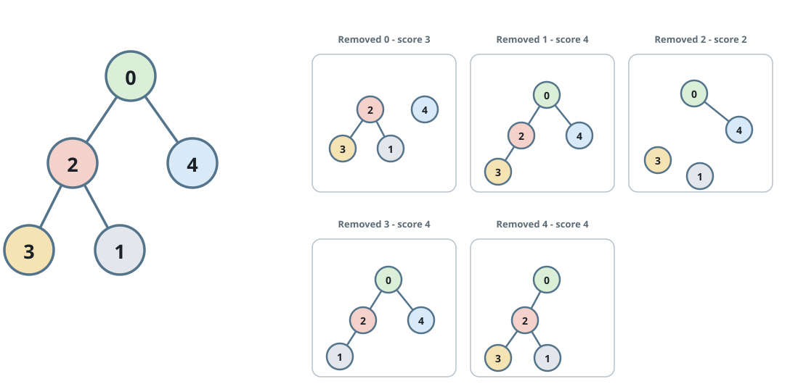
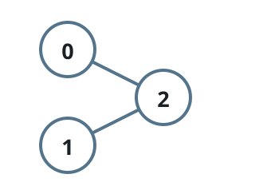

# Tied for the Best Split Score

## Description

A binary tree is grown from node `0`, which acts as its root. The tree
holds `n` nodes numbered `0` through `n - 1`, and a 0-indexed array
`parents` captures its shape: `parents[i]` stores the label of node `i`'s
parent, while `parents[0] == -1` flags the root.

Deleting a node — together with every edge incident to it — breaks the
tree into several connected pieces, each one a non-empty subtree. Define a
node's score as the product of the sizes (node counts) of all the pieces
its removal creates.

Compute this score for every node, then report how many of them share the
largest score.

### Example 1



```text
Input: parents = [-1,2,0,2,0]
Output: 3
Explanation:
- Cutting node 0 leaves pieces of sizes 3 and 1, so its score is 3 * 1 = 3.
- Node 1 is a leaf with nothing hanging above it, scoring 4.
- Cutting node 2 separates two lone nodes from a piece of size 2, scoring
  1 * 1 * 2 = 2.
- Nodes 3 and 4 are leaves too, each scoring 4.
The best score is 4, shared by nodes 1, 3, and 4 — three nodes in all.
```

### Example 2



```text
Input: parents = [-1,2,0]
Output: 2
Explanation:
- Cutting node 0 leaves a single piece holding nodes 1 and 2, scoring 2.
- Cutting node 1 likewise scores 2.
- Cutting node 2, which sits in the middle, leaves two lone nodes for a
  score of 1 * 1 = 1.
The largest score, 2, belongs to both node 0 and node 1.
```

### Constraints

- `n == parents.length`
- `2 <= n <= 10⁵`
- `parents[0] == -1`
- `0 <= parents[i] <= n - 1` for `i != 0`
- `parents` describes a valid binary tree.

## Hints

### Hint 1

One depth-first pass can settle every subtree size before you start
grading any node's removal.

### Hint 2

The piece "above" a cut node contains everything outside its own subtree,
which is `n` minus that subtree's size.

### Hint 3

Multiply the child subtree sizes together with the outside size, track the
running maximum, and count the nodes that reach it.
