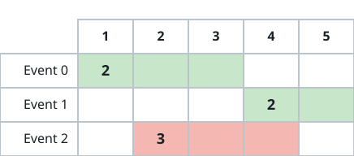
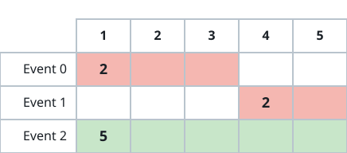
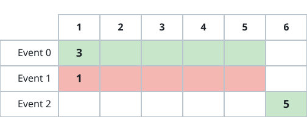

# Top Value From Two Disjoint Events

## Description

You are given a 0-indexed 2D array `events`, where
`events[i] = [startTimeᵢ, endTimeᵢ, valueᵢ]`: event `i` runs from
`startTimeᵢ` through `endTimeᵢ` and is worth `valueᵢ` points if you
attend it. Pick at most two events that do not clash, aiming to make the
combined value of your picks as large as possible.

Return that largest combined value.

Both endpoints are inclusive, so two events clash when one starts at (or
before) the moment another ends. Concretely, after attending an event that
ends at time `t`, the next event you attend must begin at `t + 1` or
later.

### Example 1



```text
Input: events = [[1,3,2],[4,5,2],[2,4,3]]
Output: 4
Explanation: Attend the two highlighted events, 0 and 1, for a combined
value of 2 + 2 = 4.
```

### Example 2



```text
Input: events = [[1,3,2],[4,5,2],[1,5,5]]
Output: 5
Explanation: Attend only event 2; its value of 5 beats any pairing.
```

### Example 3



```text
Input: events = [[1,5,3],[1,5,1],[6,6,5]]
Output: 8
Explanation: Attend events 0 and 2 for a combined value of 3 + 5 = 8.
```

### Constraints

- `2 <= events.length <= 10⁵`
- `events[i].length == 3`
- `1 <= startTimeᵢ <= endTimeᵢ <= 10⁹`
- `1 <= valueᵢ <= 10⁶`

## Hints

### Hint 1

Consider ordering the events by start time — or by end time — and see
what each ordering lets you conclude about earlier or later events.

### Hint 2

Once an event is fixed, a precomputed best value among events that finish
early enough answers the pairing question in one lookup.
