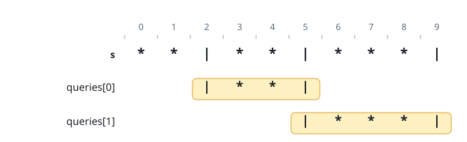
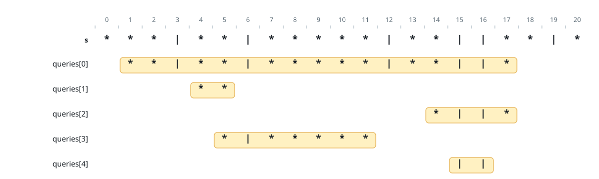

# Plates Flanked by Candles

## Description

A long table carries a row of plates and candles. You are given a
0-indexed string `s` over the characters `'*'` and `'|'`, where `'*'` is
a plate and `'|'` is a candle.

You are also given a 0-indexed 2D array `queries` with
`queries[i] = [leftᵢ, rightᵢ]`, meaning the substring
`s[leftᵢ...rightᵢ]`, endpoints included. For each query, count the plates
in that substring which sit between candles: a plate qualifies when the
substring contains at least one candle somewhere to its left and at least
one candle somewhere to its right.

As an illustration, take `s = "|*|**|"` and the query `[2, 5]`, whose
substring is `"|**|"`: both plates there have a candle on each side, so
the answer for that query is 2.

Return an array `answer` where `answer[i]` is the count for the `i`th
query.

### Example 1



```text
Input: s = "**|**|***|", queries = [[2,5],[5,9]]
Output: [2,3]
Explanation:
- The first query's substring holds two plates flanked by candles.
- The second query's substring holds three.
```

### Example 2



```text
Input: s = "***|**|*****|**||**|*", queries = [[1,17],[4,5],[14,17],[5,11],[15,16]]
Output: [9,0,0,0,0]
Explanation:
- The first query's substring contains nine flanked plates.
- None of the other queries' substrings contain any flanked plates.
```

### Constraints

- `3 <= s.length <= 10⁵`
- `s` consists of `'*'` and `'|'` characters.
- `1 <= queries.length <= 10⁵`
- `queries[i].length == 2`
- `0 <= leftᵢ <= rightᵢ < s.length`

## Hints

### Hint 1

One sweep per direction can record, for every position, the nearest
candle to its left and the nearest candle to its right.

### Hint 2

With the innermost candle pair of a query known, a prefix sum of plate
positions answers the count with a single subtraction.
