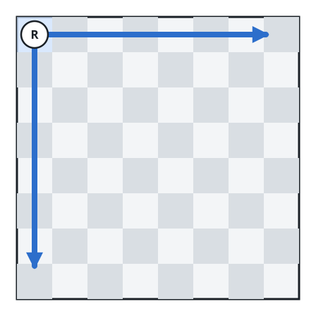
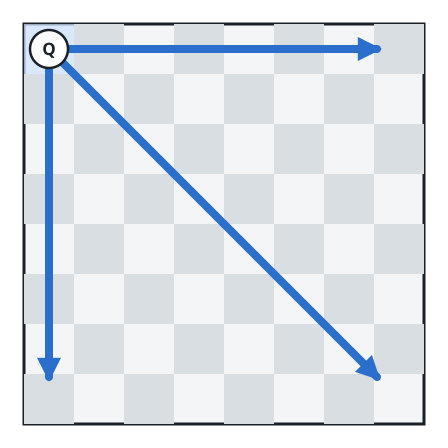
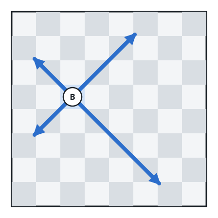

# Collision-Free Move Combinations

## Description

An 8 × 8 chessboard holds `n` pieces, each one a rook, a queen, or a
bishop. You are given a string array `pieces` of length `n` naming each
piece's type, and a 2D integer array `positions` of the same length, where
`positions[i] = [rᵢ, cᵢ]` places piece `i` on the 1-based square
`(rᵢ, cᵢ)`.

A move sends a piece toward a chosen destination square, which it may
reach along its allowed directions:

- A rook travels horizontally or vertically, stepping from `(r, c)`
  toward `(r+1, c)`, `(r-1, c)`, `(r, c+1)`, or `(r, c-1)`.
- A bishop travels diagonally, stepping toward `(r+1, c+1)`,
  `(r+1, c-1)`, `(r-1, c+1)`, or `(r-1, c-1)`.
- A queen may use both the horizontal/vertical and the diagonal
  directions.

All pieces are ordered to move at once, each with its own chosen
destination — a piece may even name the square it already occupies.
Starting at second 0, every piece that has not yet arrived jumps one
square closer to its destination each second. A move combination is the
collection of moves given to all pieces, and it is invalid if at any
second two or more pieces end up on the same square.

Return how many move combinations are valid.

Notes:

- No two pieces begin on the same square.
- Two adjacent pieces are allowed to swap squares within one second,
  passing by each other mid-move.

### Example 1



```text
Input: pieces = ["rook"], positions = [[1,1]]
Output: 15
```

### Example 2



```text
Input: pieces = ["queen"], positions = [[1,1]]
Output: 22
```

### Example 3



```text
Input: pieces = ["bishop"], positions = [[4,3]]
Output: 12
```

### Constraints

- `n == pieces.length`
- `n == positions.length`
- `1 <= n <= 4`
- `pieces` contains only the strings `"rook"`, `"queen"`, and `"bishop"`.
- At most one queen is on the chessboard.
- `1 <= rᵢ, cᵢ <= 8`
- Every entry in `positions` is distinct.

## Hints

### Hint 1

With `n` at most 4, every piece's candidate moves — staying put plus each
square reachable along its directions — can be enumerated outright.

### Hint 2

Test each candidate combination second by second for shared squares,
letting backtracking over the pieces prune clashing branches early.
