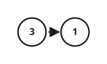
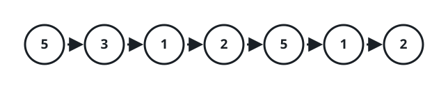
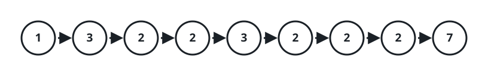

# Critical Point Gaps

## Description

Within a linked list, call a node a _turning point_ when its value is a
strict peak or a strict valley among its neighbors. Concretely, a node with
both a predecessor and a successor is a turning point when its value is
either strictly larger than both neighboring values or strictly smaller
than both. Endpoints never qualify — a node needs a neighbor on each side.

Given the head of such a list, measure across the turning points: return
`[closest, farthest]`, where `closest` is the smallest distance between any
two distinct turning points and `farthest` is the largest. If fewer than
two turning points exist, return `[-1, -1]`.

### Example 1



```text
Input: head = [3,1]
Output: [-1,-1]
Explanation: The list [3,1] contains no turning points at all.
```

### Example 2



```text
Input: head = [5,3,1,2,5,1,2]
Output: [1,3]
Explanation: Three nodes qualify:
- The third node (value 1) sits below its neighbors 3 and 2.
- The fifth node (value 5) sits above its neighbors 2 and 1.
- The sixth node (value 1) sits below its neighbors 5 and 2.
The closest pair is the fifth and sixth nodes, a distance of 6 - 5 = 1.
The farthest pair is the third and sixth nodes, a distance of 6 - 3 = 3.
```

### Example 3



```text
Input: head = [1,3,2,2,3,2,2,2,7]
Output: [3,3]
Explanation: Two nodes qualify:
- The second node (value 3) sits above its neighbors 1 and 2.
- The fifth node (value 3) sits above its neighbors 2 and 2.
Both distances come from that single pair, so closest and farthest are
both 5 - 2 = 3.
The final node does not count as a peak — it has no successor.
```

### Constraints

- The list contains between 2 and 10⁵ nodes.
- Every node holds a value from 1 to 10⁵.

## Hints

### Hint 1

The farthest pair of turning points is always the very first one paired
with the very last one.

### Hint 2

Compare each pair of neighboring turning points; the smallest of those
gaps is the closest distance.
