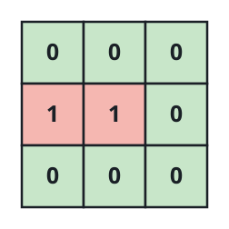
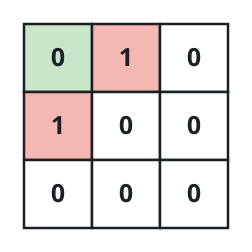

# Tiles Swept Before the Loop

## Description

A room is laid out as a 0-indexed grid of open and blocked cells: `0`
marks open floor and `1` marks an object sitting on it. The top-left cell
is open in every layout.

A robot starts on that top-left cell facing right. It keeps rolling
forward one tile at a time; whenever the tile straight ahead is outside
the room or blocked by an object, it stops in place and pivots 90 degrees
clockwise instead. The starting tile and every tile the robot rolls onto
get swept.

If the robot runs forever, how many distinct tiles of the room end up
swept? Return that count.

### Example 1



```text
Input: room = [[0,0,0],[1,1,0],[0,0,0]]
Output: 7
Explanation:
The robot sweeps (0, 0), (0, 1), and (0, 2).
At the right edge it pivots to face down, then sweeps (1, 2) and (2, 2).
At the bottom edge it pivots to face left, then sweeps (2, 1) and (2, 0).
All 7 open tiles have been swept, so the answer is 7.
```

### Example 2



```text
Input: room = [[0,1,0],[1,0,0],[0,0,0]]
Output: 1
Explanation:
The robot sweeps (0, 0). An object blocks the tile ahead, so it pivots to
face down; another object blocks that tile too, so it pivots to face
left. The edge forces pivots to face up and then right again, putting the
robot back where it started with its original heading. Only 1 tile was
swept.
```

### Example 3

```text
Input: room = [[0,1],[0,0],[0,0]]
Output: 3
Explanation:
The robot sweeps (0, 0), pivots to face down, and sweeps (1, 0) and
(2, 0). Stuck in the corner, it pivots twice to face up and walks back
along the same column; when it re-enters (0, 0) facing right, it has
repeated an earlier state, so the sweep ends with 3 tiles cleaned.
```

### Constraints

- The grid has between 1 and 300 rows and between 1 and 300 columns.
- Every cell is either `0` (open) or `1` (blocked).
- The top-left cell `room[0][0]` is open.

## Hints

### Hint 1

Step the robot one move at a time and count each newly visited tile.

### Hint 2

The robot's future is fully determined by where it is and which way it
faces — what does that imply about when the walk can stop?

### Hint 3

Stop as soon as the robot occupies a tile with the same heading it had at
some earlier moment; from there the whole walk repeats.
