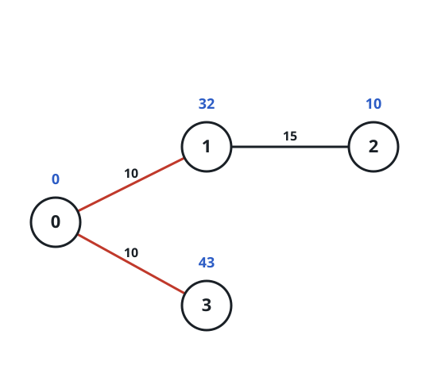
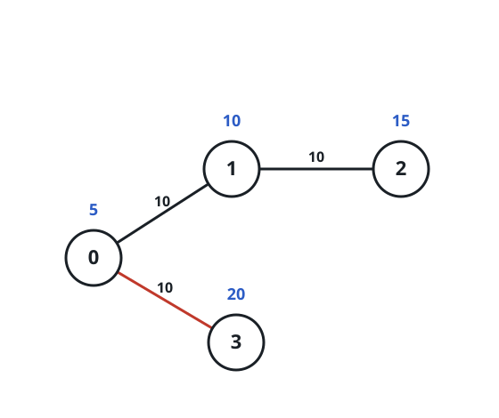
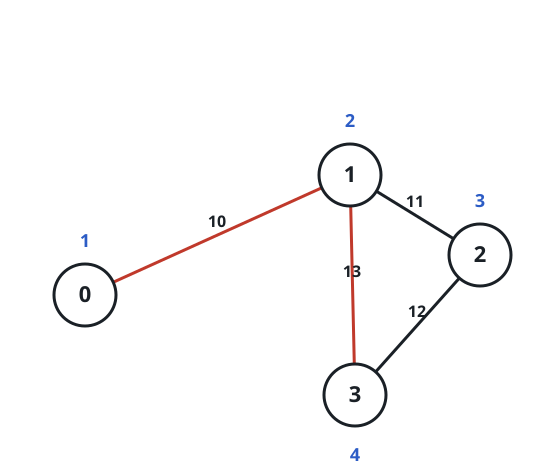

# Most Valuable Round Trip

## Description

An undirected graph holds `n` nodes numbered `0` through `n - 1`. The
0-indexed array `values` assigns each node a worth, where `values[i]`
belongs to node `i`. Its roads arrive as a 0-indexed array `edges`, in which
`edges[j] = [u_j, v_j, t_j]` means nodes `u_j` and `v_j` are joined by a
road that takes `t_j` seconds to cross in either direction. A time budget
`maxTime` is given as well.

A trip is any walk that departs from node `0` and returns to node `0`
within `maxTime` seconds; the same node may be crossed any number of times.
A trip is worth the sum of `values[i]` over the distinct nodes it touches —
each node pays out its worth once, regardless of how often the walk
revisits it.

Return the greatest worth any trip can achieve.

Note: every node has at most four roads attached to it.

### Example 1



```text
Input: values = [0,32,10,43], edges = [[0,1,10],[1,2,15],[0,3,10]], maxTime = 49
Output: 75
Explanation:
One profitable route is 0 -> 1 -> 0 -> 3 -> 0. It spends
10 + 10 + 10 + 10 = 40 seconds, inside the 49-second budget, and the
distinct nodes it touches — 0, 1, and 3 — are worth
0 + 32 + 43 = 75.
```

### Example 2



```text
Input: values = [5,10,15,20], edges = [[0,1,10],[1,2,10],[0,3,10]], maxTime = 30
Output: 25
Explanation:
The short hop 0 -> 3 -> 0 costs 10 + 10 = 20 seconds, within the budget of
30. It touches only nodes 0 and 3, worth 5 + 20 = 25.
```

### Example 3



```text
Input: values = [1,2,3,4], edges = [[0,1,10],[1,2,11],[2,3,12],[1,3,13]], maxTime = 50
Output: 7
Explanation:
The route 0 -> 1 -> 3 -> 1 -> 0 takes 10 + 13 + 13 + 10 = 46 seconds, still
under 50. Node 1 is counted once even though it is crossed twice, so the
distinct stops 0, 1, and 3 are worth 1 + 2 + 4 = 7.
```

### Constraints

- `n == values.length`
- `1 <= n <= 1000`
- `0 <= values[i] <= 10⁸`
- `0 <= edges.length <= 2000`
- `edges[j].length == 3`
- `0 <= u_j < v_j <= n - 1`
- `10 <= t_j, maxTime <= 100`
- All the `[u_j, v_j]` pairs are distinct.
- Every node touches at most four edges.
- The graph is not necessarily connected.

## Hints

### Hint 1

Every road costs at least 10 seconds. Within a budget of `maxTime`
seconds, how many nodes can a single trip possibly reach?

### Hint 2

That reach is tiny enough to search exhaustively. Walk every route out of
node `0` that fits the budget, remember which nodes have already paid out,
and take the best total seen whenever the walk closes back at node `0`.
