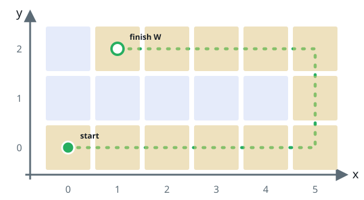

# Perimeter Rover

## Description

A `width x height` grid sits on the XY-plane with its bottom-left cell
at `(0, 0)` and its top-right cell at `(width - 1, height - 1)`. The
four cardinal directions — `"North"`, `"East"`, `"South"`, `"West"` —
are the only ways to face. A rover starts at cell `(0, 0)` facing
`"East"` and responds to movement commands. For every step of a
command it:

- tries to advance one cell in the direction it faces;
- if that cell would be outside the grid, it turns 90 degrees
  counterclockwise instead and retries the step.

Once the requested number of steps completes, the rover halts and waits
for the next command.

Implement the `Rover` class:

- `Rover(int width, int height)` initializes the grid with the rover at
  `(0, 0)` facing `"East"`.
- `void step(int num)` advances the rover `num` steps as described.
- `int[] getPos()` returns the rover's current cell as `[x, y]`.
- `String getDir()` returns the rover's current direction, one of
  `"North"`, `"East"`, `"South"`, or `"West"`.

### Example 1



```text
Input:
["Rover", "step", "step", "getPos", "getDir", "step", "step", "step", "getPos", "getDir"]
[[6, 3], [2], [2], [], [], [2], [1], [4], [], []]
Output: [null, null, null, [4, 0], "East", null, null, null, [1, 2], "West"]
Explanation:
Rover rover = new Rover(6, 3); // Initialize the grid and the rover at (0, 0) facing East.
rover.step(2);  // It moves two steps East to (2, 0), and faces East.
rover.step(2);  // It moves two steps East to (4, 0), and faces East.
rover.getPos(); // return [4, 0]
rover.getDir(); // return "East"
rover.step(2);  // It moves one step East to (5, 0), and faces East.
                // Moving the next step East would be out of bounds, so it turns and faces North.
                // Then, it moves one step North to (5, 1), and faces North.
rover.step(1);  // It moves one step North to (5, 2), and faces North (not West).
rover.step(4);  // Moving the next step North would be out of bounds, so it turns and faces West.
                // Then, it moves four steps West to (1, 2), and faces West.
rover.getPos(); // return [1, 2]
rover.getDir(); // return "West"
```

### Constraints

- `2 <= width, height <= 100`
- `1 <= num <= 10⁵`
- At most `10⁴` calls in total are made to `step`, `getPos`, and
  `getDir`.

## Hints

### Hint 1

The rover never leaves the grid's perimeter — a lap has a fixed length,
so huge step counts collapse under a modulus.

### Hint 2

Watch the starting corner: while the rover sits at `(0, 0)` before its
first move it faces `"East"`, but a full lap returns it there facing
`"South"`.
