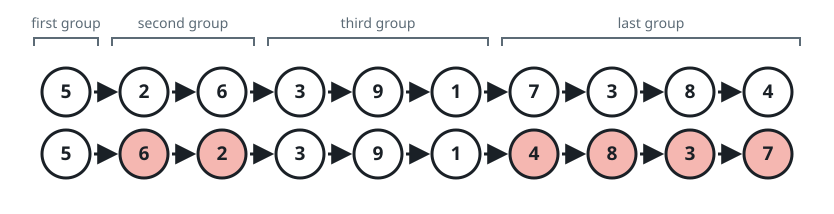
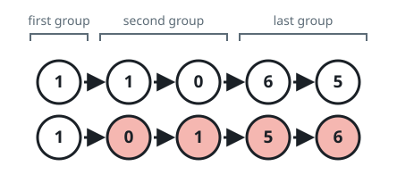

# Even Runs in Reverse

## Description

You are given the head of a singly linked list.

Chop the list, from the front, into consecutive non-empty runs whose target
sizes count upward 1, 2, 3, ... — the first node alone forms the first run,
the next two nodes form the second run, the next three form the third run,
and so on. Only the final run can come up short: it holds whatever nodes
remain, which may be fewer but never more than its target size.

Flip the order of the nodes inside every run whose actual size is even, and
return the head of the resulting list.

### Example 1



```text
Input: head = [5,2,6,3,9,1,7,3,8,4]
Output: [5,6,2,3,9,1,4,8,3,7]
Explanation:
- The runs are [5], [2,6], [3,9,1], [7,3,8,4] with sizes 1, 2, 3, 4.
- The odd-size runs keep their order; the size-2 and size-4 runs flip.
```

### Example 2


```text
Input: head = [1,1,0,6]
Output: [1,0,1,6]
Explanation:
- The runs are [1], [1,0], [6]. Only the middle run has even size, so just
  that one flips.
```

### Example 3



```text
Input: head = [1,1,0,6,5]
Output: [1,0,1,5,6]
Explanation:
- The runs are [1], [1,0], [6,5]. The last run fits its target size of 3
  only partially, arriving at size 2 — which is even, so it flips too.
```

### Constraints

- The list contains between `1` and `10⁵` nodes.
- `0 <= Node.val <= 10⁵`

## Hints

### Hint 1

Frame each run by its four boundary nodes: the node just before it, its
first node, its last node, and the node just after it. All of the surgery
happens at those boundaries.

### Hint 2

When a run flips, its former first node ends up at the run's tail — exactly
where the anchor for locating the next run should sit.

### Hint 3

After a flip, the node before the run must link to the run's old last node,
and the run's old first node must link to the node after the run.

### Hint 4

Odd-size runs need no rewiring at all — just step the anchor forward.
Start from an anchor sitting before the head with target size 1, and stop
once the anchor has no successor.
