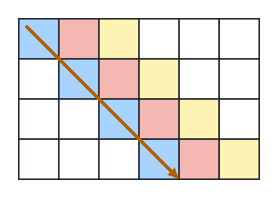
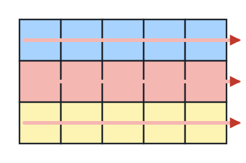
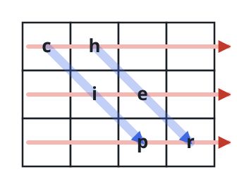
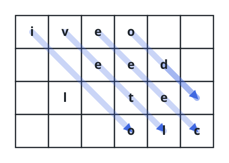
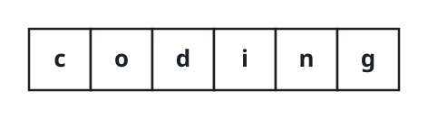

# Unscramble the Diagonal Cipher

## Description

A transposition cipher hides a message by pouring it into a grid one
down-right diagonal at a time. You are handed the scrambled output and the
grid's row count, and must recover the message.

Writing the message: with `rows` rows fixed, the message's characters fill
a grid of that height, starting at the top-left cell and advancing one cell
down and one cell right at each step. Whenever that step would leave the
grid, the pen jumps back to the leftmost still-empty cell of the top row
and continues. Every cell the pen never touches holds a space.



Reading it back out: the grid is then copied top to bottom, left to right,
exactly as it stands, spaces included. That row-major readout is the
scrambled string you are given.



For instance, scrambling `"cipher"` into a grid with `rows = 3` yields
`"ch ie pr"`:



Given the scrambled string and the row count, return the message that was
hidden in it.

Note: the hidden message never ends in trailing spaces, and the input is
guaranteed to correspond to exactly one such message.

### Example 1

```text
Input: encodedText = "ch   ie   pr", rows = 3
Output: "cipher"
Explanation: This is the scrambling shown in the figures above, played
back in reverse.
```

### Example 2



```text
Input: encodedText = "iveo    eed   l te   olc", rows = 4
Output: "i love leetcode"
Explanation: The figure shows the grid the message was poured into;
walking its diagonals from the top row spells the message out again.
```

### Example 3



```text
Input: encodedText = "coding", rows = 1
Output: "coding"
Explanation: A single-row grid reads back exactly as it went in.
```

### Constraints

- `0 <= encodedText.length <= 10⁶`
- `encodedText` consists only of lowercase English letters and spaces.
- `encodedText` is a valid scrambling of some message with no trailing
  spaces.
- `1 <= rows <= 1000`
- The input is generated so that exactly one message fits.

## Hints

### Hint 1

The grid's width follows immediately: the scrambled string is the grid
flattened row by row, so divide its length by the row count.

### Hint 2

The character sitting in grid cell `(r, c)` lives at index `r * cols + c`
of the scrambled string — that one mapping turns the string back into a
grid.

### Hint 3

Undo the placement diagonal by diagonal: from each starting column of the
top row, step down-and-right until you leave the grid, then trim the
padding spaces off the end.
