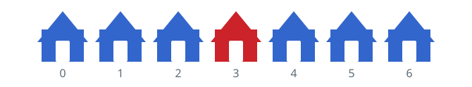
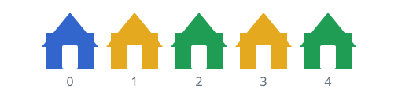

# Farthest Mismatched Houses

## Description

A row of `n` houses stands along a street, each painted in some color. You
are given a 0-indexed array `colors` of length `n`, where `colors[i]` is
the color of the `i`th house.

Pick two houses whose colors differ so that they stand as far apart as
possible, and report that distance. The distance between the `i`th and
`j`th houses is `abs(i - j)`.

### Example 1



```text
Input: colors = [1,1,1,6,1,1,1]
Output: 3
Explanation: The picture shows color 1 in blue and color 6 in red. The
best pick pits house 0 against house 3 — one blue, one red — which are
abs(0 - 3) = 3 apart. Houses 3 and 6 would do just as well.
```

### Example 2



```text
Input: colors = [1,8,3,8,3]
Output: 4
Explanation: The picture shows color 1 in blue, color 8 in yellow, and
color 3 in green. The best pick spans the whole row, house 0 (blue)
against house 4 (green), a distance of abs(0 - 4) = 4.
```

### Example 3

```text
Input: colors = [3,9,3,9]
Output: 3
Explanation: House 0 (color 3) and house 3 (color 9) differ and sit
abs(0 - 3) = 3 apart, which no other mismatched pair beats.
```

### Constraints

- `n == colors.length`
- `2 <= n <= 100`
- `0 <= colors[i] <= 100`
- The input always contains at least two houses of different colors.

## Hints

### Hint 1

With `n` at most 100, checking every pair of houses is already fast
enough.

### Hint 2

You can skip the pairwise scan: an optimal pair can always be chosen to
include an endpoint, so compare every house against the first house's
color and against the last house's color and keep the best distance.
