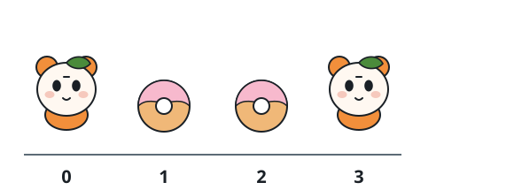
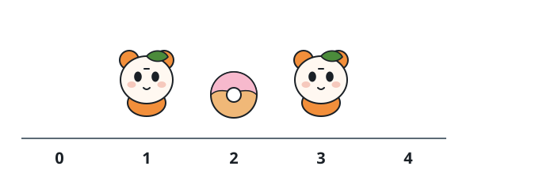
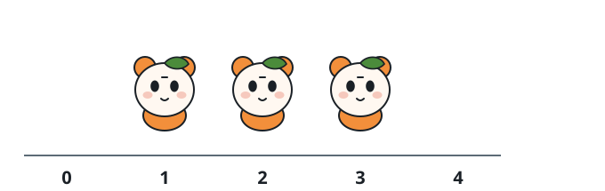

# Fewest Buckets to Feed the Row

## Description

A row is described by a string `hamsters`, where position `i` holds

- `'H'` if a hamster lives there, or
- `'.'` if the position is empty.

You may place food buckets, but only on empty positions. A bucket feeds
the hamsters standing immediately beside it: a hamster at index `i` is fed
exactly when a bucket sits at `i - 1` or at `i + 1`, and one bucket may
feed both of its neighbors at once.

Place as few buckets as possible so that every hamster is fed, returning
that minimum — or `-1` if some hamster can never be fed.

### Example 1



```text
Input: hamsters = "H..H"
Output: 2
Explanation: The buckets go on the only two empty positions, 1 and 2, and
each feeds just its neighboring hamster. A single bucket can never reach
both ends of the row.
```

### Example 2



```text
Input: hamsters = ".H.H."
Output: 1
Explanation: One bucket at index 2 stands between the two hamsters and
feeds them both.
```

### Example 3



```text
Input: hamsters = ".HHH."
Output: -1
Explanation: Even with buckets on both empty ends, the hamster at index 2
stays hungry: both of its neighbors are hamsters, so no bucket can ever
be placed beside it.
```

### Example 4

```text
Input: hamsters = "H.H"
Output: 1
Explanation: The bucket placed between them feeds both hamsters.
```

### Example 5

```text
Input: hamsters = "H"
Output: -1
Explanation: The lone hamster has no neighboring position at all, so
there is nowhere to put a bucket next to it.
```

### Constraints

- `1 <= hamsters.length <= 10⁵`
- Every character of `hamsters` is `'H'` or `'.'`.

## Hints

### Hint 1

Start by asking when the task is hopeless.

### Hint 2

A hamster with no empty neighbor — because both sides are hamsters, or
because a side does not exist — can never be fed.

### Hint 3

Otherwise sweep left to right, assuming every earlier hamster is already
fed: for the current hamster, which of its free neighbors should receive
the bucket?

### Hint 4

Prefer the empty spot on the right. That bucket may also feed the next
hamster along, while a bucket on the left can never help anyone later in
the row.
